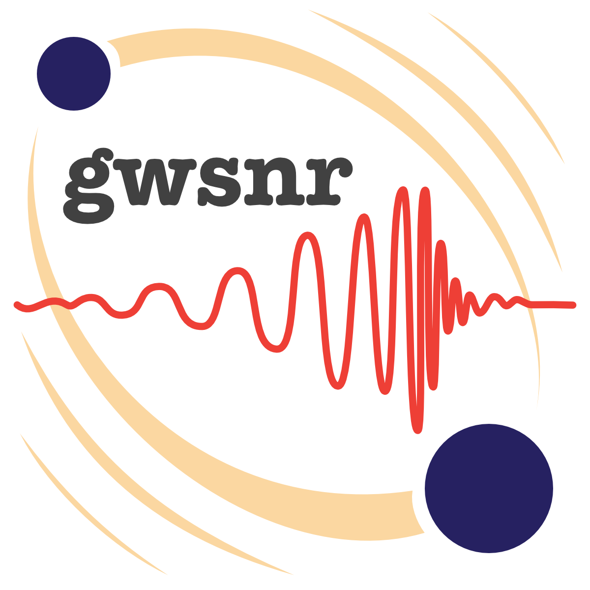

# gwsnr: Gravitational Wave Signal-to-Noise Ratio Computation Package
[]() [](https://badge.fury.io/py/gwsnr) [](https://gwsnr.readthedocs.io/en/latest/)

<p align="center">
  
</p>

## Installation

```
pip install gwsnr
```

# How to use? (Simple Example)

```
from gwsnr import GWSNR
gwsnr = GWSNR()
snr = gwsnr.snr(mass_1=30, mass_2=30, luminosity_distance=1000)
```

## About

The *`gwsnr`* Python package addresses the need for efficient SNR computation in gravitational wave research. It innovatively streamlines SNR calculations, enhancing accuracy and efficiency with several advanced techniques. Firstly, it utilizes an innovative interpolation method, employing a partial-scaling approach for accurately interpolating the SNR of gravitational waves from spin-less binary systems, focusing on the mass parameters. Secondly, the package features a noise-weighted inner product method, similar to that in the *`bilby`* package, but enhanced with multiprocessing capabilities. This integration allows for the parallel processing of complex calculations, thereby expediting the SNR computation. Thirdly, a trained Artificial Neural Network (ANN) model is incorporated for rapid 'probability of detection' (Pdet) estimation for BBH systems with spin precession.Lastly, *`gwsnr`* leverages the *`numba`* Just-In-Time (njit) compiler, which optimizes performance by compiling Python code into machine code at runtime, drastically reducing execution times. Beyond these technical merits, *`gwsnr`* stands out for its user-friendly features and seamless integration with other related software packages, making it not just a powerful tool but also an accessible one for researchers. These attributes position *`gwsnr`* as an invaluable asset in gravitational wave data analysis, particularly in simulations of detectable binary mergers, calculation of merger rates, determining gravitational wave lensing rates, and in the analysis of selection effects within hierarchical Bayesian frameworks. The package thus represents a significant step forward in gravitational wave research, enabling more precise and efficient exploration of the universe through gravitational wave observations and simulations. Additionally, *`gwsnr`* is instrumental in the *`LeR`* package for calculating detectable rates of both lensed and unlensed gravitational wave events, showcasing its utility in advanced gravitational wave studies.

# Mathematical Formulation

#### Modified FINDCHIRP Method: Partial Scaling Approach

The *`gwsnr`* package introduces the Partial Scaling method for SNR calculations in spin-less binary systems. This method, rooted in the [FINDCHIRP](https://arxiv.org/abs/gr-qc/0509116) algorithm, focuses on non-spinning IMR waveforms and particularly interpolates the Partial scaled SNR ($\rho_{1/2}$) based on mass parameters ($M_{tot},q$).

- **Interpolation Method**: Utilizes a 2D cubic spline technique (njit-ted) for the 'partialsnr' segment.

- **Equations**:

  - For a simple inspiral waveform, the optimal SNR is given by,
    $$\rho = F(D_l,\mathcal{M},\iota,\psi,\alpha, \delta, \psi) \sqrt{ 4\int_0^{f_{ISCO}} \frac{f^{-7/3}}{S_n(f)}df }$$

  - $F$ is defined as a function of luminosity distance ($D_l$), chirp mass ($\mathcal{M}$), inclination angle ($\iota$), polarization angles ($\psi$), right ascension ($\alpha$), and declination ($\delta$). $f$ is the frequency, $f_{ISCO}$ is the last stable orbit frequency and $S_n(f)$ is the detector's noise curve or power spectral density (psd).

  - Then, partial scaled SNR: $\rho_{1/2} = \sqrt{ 4\int_0^\infty \frac{f^{-7/3}}{S_n(f)}df } \approx \sqrt{ 4\int_0^{f_{ISCO}} \frac{f^{-7/3}}{S_n(f)}df }$

  - For an spinless frequency-domain IMR (Inspiral-Merger-Ringdown) waveform with optimal SNR equal to $\rho$: $\rho_{1/2} = \rho\,/\, F(D_l,\mathcal{M},\iota,\psi,\alpha, \delta, \psi)$

  - $\rho_{1/2}$ is considered a function of $M_{tot}$ and $q$.

#### Noise-Weighted Inner Product Method

Designed for SNR calculations in systems characterized by frequency domain waveforms in *`lalsimulation`*, including spin-precessing binary systems.

- **Methodology**: Combines waveform generation (multi-process), antenna pattern calculation (njit-ted), and noise-weighted inner product computation (njit-ted).

- **Equations**:

  - Inner product: 
  $$\left< a | b \right> = 4 \int_{f_{min}}^{f_{max}} \frac{\tilde{a}(f)\tilde{b}^*(f)}{S_n(f)} df$$

  - Optimal SNR: 
  
  $$\rho = \sqrt{ F_+^2 \left< \tilde{h}_+ | \tilde{h}_+ \right> + F_{\times}^2 \left< \tilde{h}_{\times} | \tilde{h}_{\times} \right> }$$
  
  for orthogonal $h_+$ and $h_{\times}$

  - $h_{+\times}$ are frequency domain waveform polarizations, and $F_{+\times}$ are antenna patterns. 

These formulations highlight *`gwsnr`'s capability to efficiently process diverse gravitational wave signals, enhancing data analysis accuracy and efficiency.

#### Artificial Neural Network (ANN) Model for Pdet Estimation

The *`gwsnr`* package now includes an artificial neural network (ANN) model for rapid estimation of the 'probability of detection' (Pdet) in binary black hole (BBH) systems using the IMRPhenomXPHM waveform approximant. This complex inspiral-merger-ringdown (IMR) waveform model accounts for spin-precessing systems with subdominant harmonics. The ANN model is especially useful when precise signal-to-noise ratio (SNR) calculations are not critical, providing a quick and effective means of estimating Pdet. This value indicates detectability under Gaussian noise by determining if the SNR exceeds a certain threshold. Trained on a large dataset from the *`LeR`* package, the ANN model uses 'partial scaled SNR' values as a primary input, reducing input dimensionality from 15 to 9 and enhancing accuracy. This approach offers a practical solution for assessing detectability under specified conditions.

## Documentation

The `gwsnr` package documentation is available at [ReadTheDocs](https://gwsnr.readthedocs.io/en/latest/).


