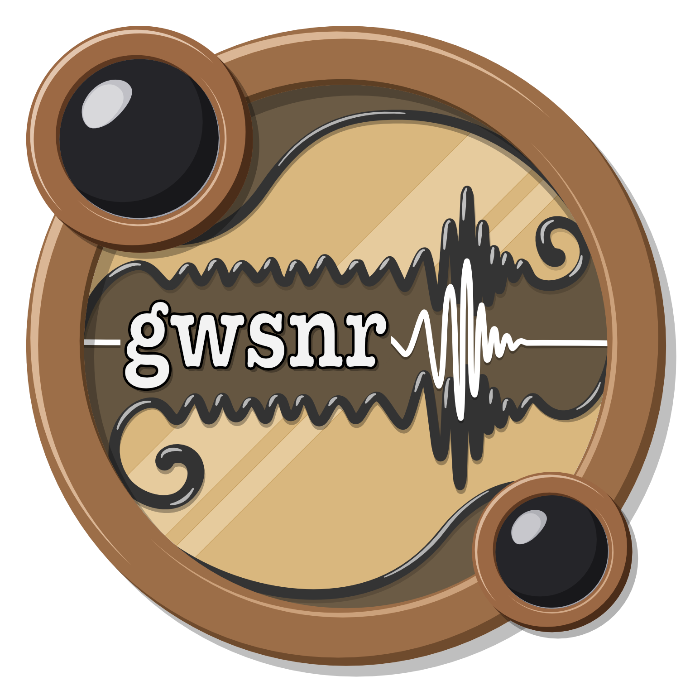

# gwsnr: Gravitational Wave Signal-to-Noise Ratio Computation Package
[](https://hemantaph.github.io/gwsnr/) [](https://badge.fury.io/py/gwsnr) []()


<p align="center">
  
</p>

## Installation

```bash
pip install gwsnr
```

## Example Usage

```python
from gwsnr import GWSNR
gwsnr = GWSNR()
snrs = gwsnr.optimal_snr(mass_1=30, mass_2=30, distance=1000, psi=0.0, phase=0.0, geocent_time=1246527224.169434, ra=0.0, dec=0.0)
pdet = gwsnr.pdet(mass_1=30, mass_2=30, distance=1000, psi=0.0, phase=0.0, geocent_time=1246527224.169434, ra=0.0, dec=0.0)
print(f"SNR value: {snrs}, P_det value: {pdet}")
```

## Summary

**`gwsnr`** is a high-performance Python package for efficient and accurate computation of the **optimal signal-to-noise ratio** ($\rho_{\rm opt}$) and **probability of detection** ($P_{\rm det}$) in gravitational-wave (GW) astrophysics.  
It is designed for large-scale simulations of compact binary mergers—such as **BBH**, **BNS**, and **BH–NS** systems—and for hierarchical Bayesian inference studies that require repeated SNR or $P_{\rm det}$ evaluations under selection effects.

Traditional SNR calculations rely on noise-weighted inner products and are computationally intensive. `gwsnr` overcomes this bottleneck by combining **NumPy** vectorization, **JIT compilation** via [`Numba`](https://numba.pydata.org/), [`JAX`](https://github.com/google/jax), and [`MLX`](https://ml-explore.github.io/mlx/), along with **Python multiprocessing**. This combination enables massive acceleration on both CPUs and GPUs, achieving several orders-of-magnitude speed-up over conventional approaches.

---

### Key Capabilities

- **Noise-Weighted Inner Product:**  
  Provides accurate SNR computation for arbitrary frequency-domain waveforms, including precessing and higher-order harmonic models available in [`LALSuite`](https://lscsoft.docs.ligo.org/lalsuite/lalsimulation/).  
  Accelerated using multiprocessing and JIT-compiled routines, with optional `JAX` backend integration via [`ripple`](https://github.com/tedwards2412/ripple).

- **Partial-Scaling Interpolation:**  
  Implements an interpolation-based approach for aligned-spin or non-spinning binaries.  
  Precomputes partial-scaled SNRs on parameter grids, enabling rapid recovery of $\rho_{\rm opt}$ by simple rescaling—dramatically reducing computational cost.

- **ANN-Based $P_{\rm det}$ Estimation:**  
  Incorporates a trained Artificial Neural Network (ANN) built with `TensorFlow` and `scikit-learn`, capable of estimating detectability for precessing systems using reduced-dimensional input derived from partial-scaled SNRs.  
  The model can be retrained for different detectors or astrophysical scenarios.

- **Hybrid SNR Recalculation:**  
  Combines the speed of interpolation or ANN-based estimates with the precision of the inner-product method.  
  Signals near the detection threshold are automatically re-evaluated for higher accuracy.

- **Statistical $P_{\rm det}$ Models:**  
  Implements Gaussian and non-central $\chi$-based statistical models for observed SNRs across single or multi-detector networks.  
  Supports user-defined detection thresholds and catalogue-based sensitivity functions.

- **Horizon Distance ($D_{\rm hor}$):**  
  Calculates the maximum distance at which a source is detectable above a given $\rho_{\rm opt,thr}$, using either analytical rescaling or numerical root-solving.  
  Useful for sensitivity studies and detector reach estimations.

- **Integration and Extensibility:**  
  Provides a modular API to flexibly combine waveform models, detector noise PSDs, and configuration parameters—ideal for population synthesis, rate estimation, and hierarchical inference with selection effects.

---

### Applications

`gwsnr` underpins simulations and analyses of **GW population statistics**, **rate estimation**, and **lensed versus unlensed event predictions**—as demonstrated in the [`ler`](https://ler.readthedocs.io/en/latest/) package.  
Its computational efficiency makes it particularly suited for **hierarchical Bayesian frameworks** that require rapid, repeated evaluation of $P_{\rm det}$ across large parameter spaces.

## Documentation

The `gwsnr` package documentation is available at [ReadTheDocs](https://gwsnr.hemantaph.com).


