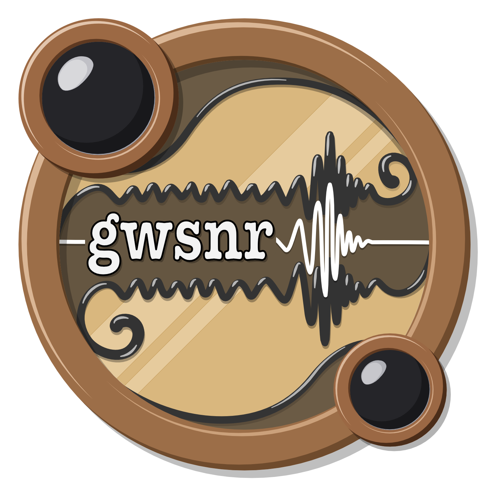

# gwsnr

[](https://doi.org/10.5281/zenodo.17803640)
[](https://badge.fury.io/py/gwsnr)
[](https://gwsnr.hemantaph.com/)

<p align="center">
  
</p>

`gwsnr` is a Python package for efficient and accurate computation of the
optimal signal-to-noise ratio ($\rho_{\rm opt}$) and probability of detection
($P_{\rm det}$) for simulated gravitational-wave (GW) populations. It is
designed for large-scale studies of compact-binary mergers (BBH, BNS, and
BH-NS systems), selection-effect modeling, and hierarchical Bayesian inference
where repeated detectability evaluations are required.

Traditional noise-weighted inner-product calculations are accurate but
computationally expensive at population scale. `gwsnr` addresses this
bottleneck with multiple accelerated evaluation paths under one interface,
including multiprocessing inner products, partial-scaling interpolation,
ANN-based approximations, and hybrid recalculation near the detection
threshold. The package supports flexible detector networks, waveform models,
and noise power spectral densities, and is used as the core detectability
engine in [`ler`](https://ler.hemantaph.com/).

`gwsnr` is intended for LIGO-Virgo-KAGRA researchers and astrophysicists
working on population simulations, rate estimation, detector-sensitivity
studies, and selection-function modeling.

## Installation

`gwsnr` supports Python 3.10+; Python 3.11 is recommended in the
documentation.

Recommended installation with `uv`:

```bash
uv add gwsnr
```

You can also install with `pip`:

```bash
pip install gwsnr
```

Optional backends can be installed when needed:

```bash
pip install gwsnr jax jaxlib              # JAX backend
pip install gwsnr mlx                       # MLX backend (Apple Silicon)
pip install gwsnr jax jaxlib ripplegw       # ripple-based JAX waveforms
pip install gwsnr scikit-learn tensorflow   # ANN-based Pdet estimation
```

For development, clone the repository and install in editable mode:

```bash
git clone https://github.com/hemantaph/gwsnr.git
cd gwsnr
pip install -e ".[dev]"
```

## Quick start

```python
from gwsnr import GWSNR

gwsnr = GWSNR()

# Compute optimal SNR and Pdet for a 30-30 Msun binary at 1000 Mpc
snrs = gwsnr.optimal_snr(
    mass_1=30,
    mass_2=30,
    luminosity_distance=1000,
    psi=0.0,
    phase=0.0,
    geocent_time=1246527224.169434,
    ra=0.0,
    dec=0.0,
)
pdet = gwsnr.pdet(
    mass_1=30,
    mass_2=30,
    luminosity_distance=1000,
    psi=0.0,
    phase=0.0,
    geocent_time=1246527224.169434,
    ra=0.0,
    dec=0.0,
)

print(f"SNR value: {snrs},\nP_det value: {pdet}")
```

## What `gwsnr` does

- computes $\rho_{\rm opt}$ using noise-weighted frequency-domain inner products
- accelerates inner-product evaluation with multiprocessing, `numba`, and
  optional `JAX`/`ripplegw` backends
- provides a fast partial-scaling interpolation method for non-spinning and
  aligned-spin binaries
- supports ANN-based $P_{\rm det}$ estimation for settings where direct
  interpolation is impractical
- uses hybrid recalculation to re-evaluate events near the detection threshold
  with the exact inner-product method
- models observed/matched-filter SNR ($\rho_{\rm obs}$) statistically under
  stationary Gaussian noise assumptions
- estimates detection thresholds from injection catalogues
- calculates horizon distance ($D_{\rm hor}$) for sensitivity and reach studies
- exposes a modular API for custom detector, waveform, and population settings

## Method overview

The baseline optimal SNR follows the standard frequency-domain inner product,

$$
\rho =
\sqrt{
F_+^2 \langle \tilde{h}_+|\tilde{h}_+\rangle
+
F_\times^2 \langle \tilde{h}_\times|\tilde{h}_\times\rangle
},
$$

where $F_+$ and $F_\times$ are antenna-pattern factors.

For non-spinning and aligned-spin systems, `gwsnr` uses partial-scaling
interpolation based on FINDCHIRP scaling. A precomputed partial-scaled SNR
$\rho_{1/2} = (D_{\rm eff}/\mathcal{M}^{5/6})\,\rho_{\rm opt}$ is stored on
grids and rescaled as

$$
\rho_{\rm opt}
=
\rho_{1/2}
\frac{\mathcal{M}^{5/6}}{D_{\rm eff}} .
$$

For a deterministic detection threshold on a chosen SNR quantity $\rho$,

$$
P_{\rm det}
=
P({\rm det}\mid\vec{\theta})
=
\Theta(\rho-\rho_{\rm th}),
$$

where $\vec{\theta}$ denotes the GW parameters and $\Theta$ is the Heaviside
step function. When $\rho_{\rm obs}$ is treated as noise-dependent,
$P_{\rm det}$ is obtained by averaging over the assumed noise distribution.

## Documentation

The documentation is available at:

https://gwsnr.hemantaph.com/

Useful sections include:

- [Installation](https://gwsnr.hemantaph.com/Installation.html)
- [Code overview](https://gwsnr.hemantaph.com/Codeoverview.html)
- [Inner-product method](https://gwsnr.hemantaph.com/innerproduct.html)
- [Partial-scaling interpolation](https://gwsnr.hemantaph.com/interpolation.html)
- [Probability of detection](https://gwsnr.hemantaph.com/probabilityofdetection.html)
- [Performance summary](https://gwsnr.hemantaph.com/performancesummary.html)
- [Examples](https://gwsnr.hemantaph.com/examples/snr_generation.html)

For the full technical description, see the
[`gwsnr` paper](https://arxiv.org/abs/2412.09888).

## Community guidelines

Guidelines for contributing, reporting issues, and seeking support are available
in [CONTRIBUTING.md](CONTRIBUTING.md).

Issues can be reported at:

https://github.com/hemantaph/gwsnr/issues

## Citation

If `gwsnr` supports your research, please cite:

```bibtex
@misc{phurailatpam2025gwsnrpythonpackageefficient,
  title={gwsnr: A python package for efficient signal-to-noise calculation of gravitational-waves},
  author={Hemantakumar Phurailatpam and Otto Akseli Hannuksela},
  year={2025},
  eprint={2412.09888},
  archivePrefix={arXiv},
  primaryClass={astro-ph.IM},
  url={https://arxiv.org/abs/2412.09888},
}
```

Software releases are archived on Zenodo:
https://doi.org/10.5281/zenodo.17803640
