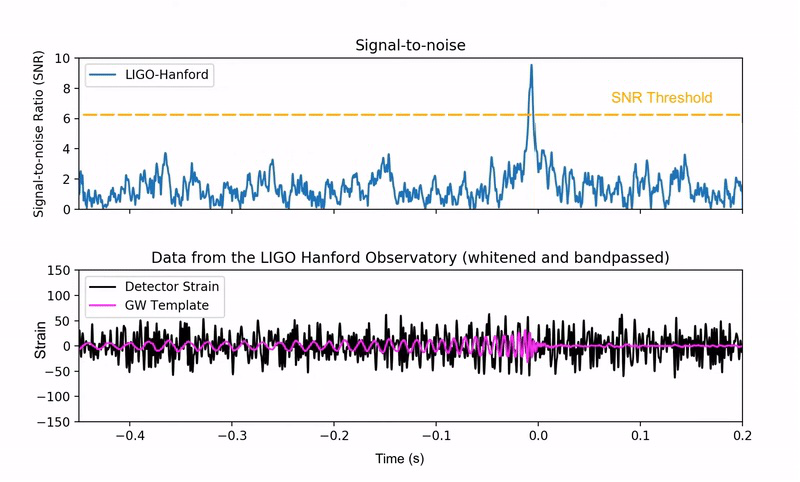

## Summary

    

    <em>Detection of a gravitational wave signal in noisy data. Top (cartoon): Signal-to-noise ratio (SNR) as a function of GPS time, with the SNR threshold (orange dashed line) indicating the minimum required for confident detection. The sharp peak crossing the threshold marks a detectable GW event. Bottom (cartoon): Strain versus GPS time, showing the gravitational wave signal (blue) embeded in background noise (grey).</em>

Gravitational waves (GWs)—ripples in spacetime predicted by Einstein’s theory of General Relativity—have revolutionized astrophysics since their first direct detection in 2015 [@Abbott:2016](http://dx.doi.org/10.1103/PhysRevLett.116.061102) [@Abbott:2016:pe](http://dx.doi.org/10.1103/physrevlett.116.241102). These signals, emitted by the mergers of compact objects such as binary black holes (BBHs), binary neutron stars (BNSs), and black hole–neutron star pairs, provide unique insights into the universe. A central quantity in GW data analysis is the **signal-to-noise ratio** (SNR), which quantifies the strength of a GW signal relative to the noise in detectors like LIGO [@LIGO:2015](https://dx.doi.org/10.1088/0264-9381/32/7/074001) [@Abbott:2020](http://dx.doi.org/10.1007/s41114-020-00026-9) [@Buikema:2020](https://link.aps.org/doi/10.1103/PhysRevD.102.062003), Virgo [@VIRGO:2015](https://dx.doi.org/10.1088/0264-9381/32/2/024001) [@VIRGO:2019](https://link.aps.org/doi/10.1103/PhysRevLett.123.231108), and KAGRA [@Akutsu:2020](https://arxiv.org/abs/2005.05574) [@Aso:2013](https://link.aps.org/doi/10.1103/PhysRevD.88.043007). Reliable SNR estimation is essential for confirming GW detections and performing astrophysical inference [@Abbott:2016:detection](http://dx.doi.org/10.1103/physrevd.93.122003). However, modern GW research—especially in population simulations [@Abbott:2016:rates](http://dx.doi.org/10.3847/2041-8205/818/2/l22) and hierarchical Bayesian inference with selection effects [@Thrane:2019](http://dx.doi.org/10.1017/pasa.2019.2)—requires the computation of SNRs for vast numbers of systems, making traditional methods based on noise-weighted inner products prohibitively slow [@Taylor:2018](http://dx.doi.org/10.1103/physrevd.98.083017) [@Gerosa:2020](http://dx.doi.org/10.1103/physrevd.102.103020).

The **`gwsnr`** Python package addresses this computational bottleneck, offering a flexible, high-performance, and user-friendly framework for SNR and probability of detection ($P_{\rm det}$) estimation. At its core, `gwsnr` leverages `NumPy` vectorization [@numpy:2022](https://numpy.org/) alongside Just-In-Time (JIT) compilation via `numba` [@numba:2022](https://numba.pydata.org/) and `JAX` [@jax:2018](https://github.com/google/jax) to deliver exceptional performance.

### Key Features

* **Noise-Weighted Inner Product with Multiprocessing**: Provides accurate SNR calculations for arbitrary waveforms, including those with spin precession and higher-order harmonics available in `lalsimulation` [@lalsuite:2018](https://doi.org/10.7935/GT1W-FZ16). The method is enhanced with multiprocessing and JIT compilation to accelerate computation, with optional support for JAX-based waveform libraries like `ripple` [@Edwards:2023](https://doi.org/10.1103/PhysRevD.110.064028).
* **Partial Scaling Interpolation**: An innovative and highly efficient interpolation method for accurately calculating the SNR of non-precessing (spinless or aligned-spin) binary systems. This approach dramatically reduces computation time, making large-scale analyses practical.
* **ANN-Based $P_{\rm det}$ Estimation**: Incorporates a trained Artificial Neural Network (ANN) for rapid probability of detection estimates for precessing BBH systems. This is particularly useful when exact SNR values are not required. This approach is similar to other efforts using ANNs for GW analysis [@ChapmanBird:2023](http://dx.doi.org/10.1093/mnras/stad1397) [@Gerosa:2020](http://dx.doi.org/10.1103/physrevd.102.103020) [@Callister:2024](http://dx.doi.org/10.1103/PhysRevD.110.123041).
* **Hybrid SNR Recalculation**: A balanced approach that combines the speed of the partial scaling method with the precision of the noise-weighted inner product, ensuring high accuracy for systems near the detection threshold.
* **Integration and Flexibility**: Offers a user-friendly interface to combine various detector noise models, waveform models, detector configurations and signal parameters.

These capabilities make `gwsnr` an invaluable tool for GW data analysis, particularly for determining the rates of lensed and unlensed GW events (as demonstrated by its use in the `ler` package [@ler:2024](https://arxiv.org/abs/2407.07526) [@Leo:2024](https://arxiv.org/abs/2403.16532) [@More:2025](https://arxiv.org/abs/2502.02536) [@Janquart:2023](https://doi.org/10.1093/mnras/stad2909) [@Abbott:2021](http://dx.doi.org/10.3847/1538-4357/ac23db) [@ligolensing:2023](https://arxiv.org/abs/2304.08393) [@Wierda:2021](https://doi.org/10.3847/1538-4357/ac1bb4) [@Wempe:2022](https://arxiv.org/abs/2204.08732)) and for modeling selection biases in hierarchical Bayesian frameworks [@Thrane:2019](http://dx.doi.org/10.1017/pasa.2019.2).

### Mathematical Formulation

`gwsnr` implements two primary methods for SNR computation and two for $P_{\rm det}$ estimation [@gwsnr:documentation](https://gwsnr.readthedocs.io/en/latest/):

* **Noise-Weighted Inner Product Method**: This method computes the optimal SNR $\rho$ using the noise-weighted inner product, defined as $\rho = \sqrt{\langle h | h \rangle}$ [@Allen:2012](http://dx.doi.org/10.1103/physrevd.85.122006). For a signal with plus ($h_+$) and cross ($h_\times$) polarizations, the SNR is given by:
    $$
    \rho = \sqrt{ F_+^2 \left< \tilde{h}_+ | \tilde{h}_+ \right> + F_{\times}^2 \left< \tilde{h}_{\times} | \tilde{h}_{\times} \right> }
    $$
    where $F_+$ and $F_\times$ are the detector's antenna patterns and the inner product is:
    $$
    \left< a | b \right> = 4 \Re \int_{f_{\min}}^{f_{\max}} \frac{\tilde{a}(f)\tilde{b}^*(f)}{S_n(f)} df
    $$

* **Partial Scaling Interpolation Method**: For non-precessing systems, this method uses a pre-computed grid of "partial-scaled SNR" ($\rho_{1/2}$) values, which depend only on intrinsic parameters like mass and spin. The SNR for a new set of parameters is found by scaling the interpolated grid value:
    $$
    \rho = \rho_{1/2} \times \left(\frac{\mathcal{M}}{M_\odot}\right)^{5/6} \times \left(\frac{1~\mathrm{Mpc}}{D_\mathrm{eff}}\right)
    $$
    where $\mathcal{M}$ is the chirp mass and $D_{\text{eff}}$ is the effective distance. This transforms a slow integration into a fast interpolation and multiplication.

* **Hybrid & ANN Methods for $P_{\rm det}$**: For precessing binaries where the above interpolation is inexact, `gwsnr` offers two solutions. The hybrid method uses the fast interpolation to identify candidate systems near the detection threshold ($\rho_{\rm th}=8$) and then recalculates their SNRs accurately using the inner product. Alternatively, a trained ANN (developed with `TensorFlow` [@tensorflow:2015](https://www.tensorflow.org/) and `scikit-learn` [@scikitlearn:2011](http://dx.doi.org/10.5555/1953048.2078195)) provides direct $P_{\rm det}$ estimates from the partial-scaled SNR and other key parameters, enabling rapid assessments of detectability.

Full mathematical and implementation details are provided in the [package documentation](https://gwsnr.readthedocs.io/en/latest/).