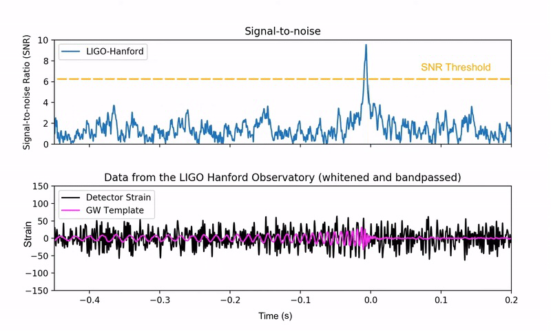

# Summary

<figure align="center">
  
  <figcaption align="left">
    <b>Figure.</b> Detection of a gravitational wave signal in noisy data. Top panel: Signal-to-noise ratio (SNR) as a function of GPS time, with the SNR threshold (orange dashed line) indicating the minimum required for confident detection. The sharp peak crossing the threshold marks a detectable GW event. Bottom panel: Detector strain data versus GPS time, showing the gravitational wave waveform template (pink) aligned with a signal embedded in background noise (black).
  </figcaption>
</figure>

**`gwsnr`** is a Python package for efficient and accurate computation of the **optimal signal-to-noise ratio** ($\rho_{\rm opt}$) and **probability of detection** ($P_{\rm det}$) in gravitational-wave (GW) astrophysics. It is designed for large-scale simulations of compact binary mergers (BBH, BNS, and BH-NS systems) and for hierarchical Bayesian inference studies that require repeated SNR or $P_{\rm det}$ evaluations under selection effects.

In population simulations and rate-estimation workflows, $P_{\rm det}$ must be evaluated many times. Standard noise-weighted inner products are accurate but become a bottleneck at scale. Packages such as `Bilby`, `PyCBC`, and `GstLAL` are not primarily built for millions of fast detectability checks. `gwsnr` fills that gap: it provides a modular detectability engine with user-controlled detector, waveform, and population settings, and can model both $\rho_{\rm opt}$ and the noise-realised [matched-filter SNR](detectionstatistics.html#defining-match-filter-snr) ($\rho_{\rm obs}$) under stationary Gaussian noise assumptions.

To gain speed, `gwsnr` combines **NumPy** vectorisation, **JIT compilation** via [`Numba`](https://numba.pydata.org/), optional [`JAX`](https://github.com/google/jax) and [`MLX`](https://ml-explore.github.io/mlx/) backends, and **Python multiprocessing**. The partial-scaling interpolation path achieves accuracy above **99.5%** compared with standard inner-product calculations and speed-ups of order **$5{,}000\times$** relative to `Bilby` in benchmark tests (see [performance summary](performancesummary.html)). The package is used as the core detectability calculator in [`ler`](https://ler.hemantaph.com/).

---

### Key capabilities

- **Noise-weighted inner product:**  
  Accurate SNR computation for arbitrary frequency-domain waveforms, including precessing and higher-order harmonic models from [`LALSuite`](https://lscsoft.docs.ligo.org/lalsuite/lalsimulation/). Accelerated with multiprocessing and JIT-compiled routines; optional `JAX` backend via [`ripplegw`](https://github.com/tedwards2412/ripple).

- **Partial-scaling interpolation:**  
  Fast method for non-spinning and aligned-spin binaries. Precomputes partial-scaled SNRs on parameter grids and recovers $\rho_{\rm opt}$ by simple rescaling.

- **ANN-based $P_{\rm det}$ estimation:**  
  Optional `TensorFlow`/`scikit-learn` model for settings where direct interpolation is impractical. Users can retrain models for different detectors or populations.

- **Hybrid SNR recalculation:**  
  Uses interpolation or ANN estimates first, then re-evaluates events near the detection threshold with the exact inner-product method.

- **Statistical $P_{\rm det}$ models:**  
  Gaussian and non-central $\chi^2$ models for $\rho_{\rm obs}$ in single- and multi-detector networks. Supports user-defined thresholds and catalogue-based sensitivity functions.

- **Horizon distance ($D_{\rm hor}$):**  
  Maximum distance at which a source is detectable above a given $\rho_{\rm opt,th}$, via analytical rescaling or numerical root-finding.

- **Modular API:**  
  Flexible combination of waveform models, detector noise PSDs, and configuration parameters for population synthesis, rate estimation, and hierarchical inference with selection effects.

---

### Applications

`gwsnr` supports GW population statistics, astrophysical rate estimation, detector-sensitivity studies, and selection-effect modeling in hierarchical inference. It is integrated into [`ler`](https://ler.hemantaph.com/) for simulating detectable unlensed and strongly lensed events.

For the full technical description, see the [`gwsnr` paper](https://arxiv.org/abs/2412.09888). Mathematical and implementation details are in [Inner Product](innerproduct.html), [Interpolation](interpolation.html), [ANN](ann.html), [Hybrid](hybrid.html), [Probability of Detection](probabilityofdetection.html), and [Horizon Distance](horizondistance.html).
