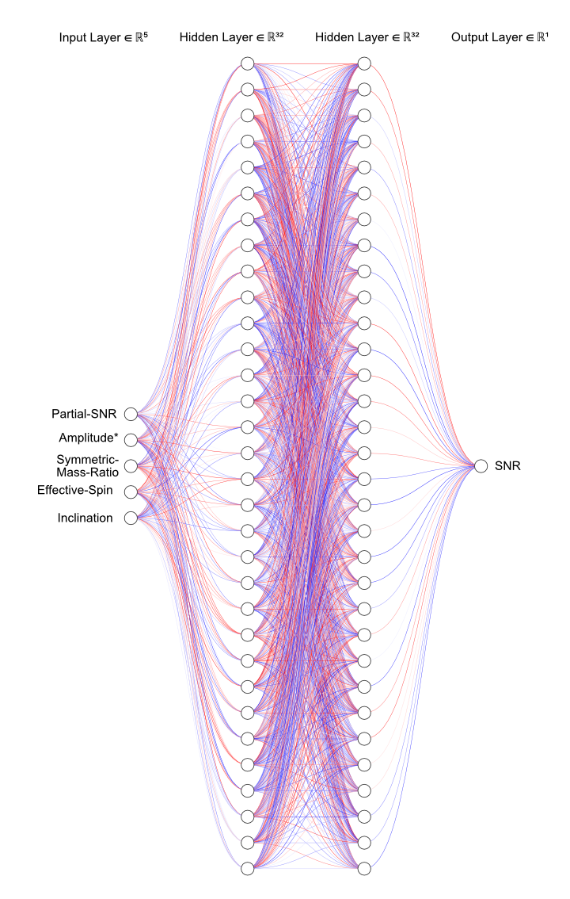

# ANN-based Pdet Estimation

The `gwsnr` package now incorporates an artificial neural network (ANN) model, developed using TensorFlow (@tensorflow:2015) and scikit-learn (@scikitlearn:2011), to rapidly estimate $P_{\rm det}$ in binary black hole (BBH) systems using the IMRPhenomXPHM waveform approximant. This complex IMR waveform model accounts for spin-precessing systems with subdominant harmonics. The ANN model is especially useful when precise signal-to-noise ratio (SNR) calculations are not critical, providing a quick and effective means of estimating $P_{\rm det}$. This value indicates detectability under Gaussian noise by determining if the SNR exceeds a certain threshold (e.g., $\rho_{\rm th}=8$). Trained on a large dataset from the `ler` package, the ANN model uses 'partial scaled SNR' values as a primary input, reducing input dimensionality from 15 to 5 and enhancing accuracy. This approach offers a practical solution for assessing detectability under specified conditions. Other similar efforts with ANN models are detailed in (@ChapmanBird:2023, @Gerosa:2020, @Callister:2024).

## Data generation

Using the `ler` package, a large dataset of compact binary systems is generated, covering the 15 parameters relevant for the IMRPhenomXPHM waveform model. This includes Gravitational wave source properties: $m_1$ (mass of the primary black hole), $m_2$ (mass of the secondary black hole), $d_L$ (luminosity distance), $\iota$ (inclination-angle), ($a_1, a_2$) (dimensionless spin of the primary and secondary black hole), $a_2$ (dimensionless spin of the secondary black hole), ($\theta_1, \theta_2$) (tilt angle of the primary and secondary black hole), $\delta \phi$ (relative angle between the primary and secondary spin of the binary), $\phi_{\rm JL}$ (angle between total and orbital angular momentum), ($ra, dec$) (right ascension and declination), $\psi$ (polarization angle), $\phi_c$ (coalescence phase), and $t_c$ (geocentric time of coalescence). With appropriate waveform approximant and noise model, SNR values are computed with inner product method, which is the most accurate method for computing SNRs in `gwsnr`. The dataset is generated with a range of SNR values, particularly around the threshold SNR of 8, to ensure the ANN model can generate accurate estimates of SNR and then $P_{\rm det}$ can be computed from the SNR values accurately. The dataset is then stored in a json file. At least 100,000 samples are generated to ensure a robust training dataset. The dataset is then split into training and testing sets, with 90% of the data used for training and 10% for testing. The training set is used to train the ANN model, while the testing set is used to evaluate the model's performance.

Increasing the number of samples in the dataset improves the accuracy of the ANN model.

## ANN Model Architecture and Training

The waveform for which the SNR is computed is the IMRPhenomXPHM waveform model, which is a precessing waveform model that includes subdominant harmonics. There is non-linear dependence of the SNR on the intrinsic parameters of the binary system (where the aplitude oscillates rapidly when the spin is high and misaligned with the angular momentum), which makes it difficult to estimate the SNR accurately using traditional interpolation methods. The ANN model is trained to learn this non-linear dependence and provide modestly accurate estimates of the SNR, and a reasonable estimate of $P_{\rm det}$. 

To further improve the performance of the ANN model, the input data is preprocessed to reduce dimensionality, but to preserve important information. The input data consists of 15 parameters, which are reduced to 5 parameters using the following approach:

- Creating input data: The generated dataset is used to create input data for the ANN model. The input data consists of: 
 1. Partial-SNR ($\rho_{\frac{1}{2}}$) which captures the SNR contribution from the dominant (2,2)-mode of the waveform that depends on the the intrinsic parameters of the binary system, but is independent of the extrinsic parameters.
 2. Amplitude$^*$  ($\frac{\mathcal{M}^{5/6}}{D_\mathrm{eff}}$) which capture the amplitude scaling of the waveform.
 3. Symmetric mass ratio ($\eta$) which is a function of the component masses of the binary system.
 4. Effective spin ($\chi_\mathrm{eff}$) which is a function of the component spins of the binary system, captures the magnitude of the spin aligned with the orbital angular momentum and also the misalignment of the spins with respect to the orbital angular momentum.
 5. Inclination angle ($\theta_\mathrm{JN}$) which is the angle between the total angular momentum of the binary system and the line of sight to the observer.

 Standard scaling (sklearn.preprocessing.StandardScaler) is applied to the input data to ensure that all input features are on the same scale, which helps in training the ANN model effectively. The input data is then split into training and testing sets, with 90% of the data used for training and 10% for testing.

 The ANN model is then trained using the training set, with the input data and the following prescribed settings,

 - adam optimizer with a learning rate of 0.001,
 - mean squared error loss function,
 - 100 epochs with early stopping based on validation loss,
 - batch size of 32.
 - The model architecture consists of 5 input neurons with ReLU activation function, followed by 2 hidden layers with 32 neurons each, using ReLU and Sigmoid activation functions, respectively. The output layer has a single neuron with a linear activation function to predict the SNR value.
 - The model is trained using the training set, and the validation set is used to monitor the performance of the model during training. The model is saved after training, and can be used to predict the SNR values for new input data by providing the path in the `gwsnr` initialization.

The data generation, training, and testing of the ANN model and using the generated model with `gwsnr` is detailed in the `examples/ann.ipynb` notebook. This is also a blueprint for training custom ANN models for other waveform approximants or PSDs or detector configurations.

The model architecture is shown in the figure below. 

<figure>
    
    <figcaption>
        <b>Figure.</b> ANN model architecture for estimating $P_{\rm det}$ in binary black hole (BBH) systems. The model takes 'partial scaled SNR' values as input and outputs the estimated detection probability. This approach significantly reduces input dimensionality and enhances estimation accuracy.
    </figcaption>
</figure>

