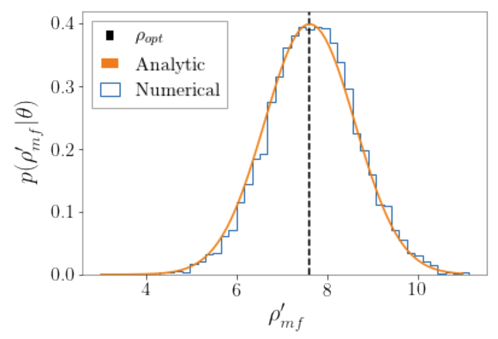

# Detection Statistics of Gravitational Waves

When a gravitational wave (GW) reaches a detector, such as a laser interferometer with arm lengths spanning several kilometers, the changing space-time curvature caused by the passing wave induces tiny displacements in the detector's arms. This physical effect is measured as a strain, which represents the fractional change in the length of the arms. The magnitude of this strain is typically on the order of $10^{-21}$ or smaller, making its detection an extraordinary technical challenge. The successful observation of such minuscule effects requires not only highly sensitive instruments but also the application of sophisticated data analysis techniques.  

Current gravitational wave observatories like the Laser Interferometer Gravitational-Wave Observatory (LIGO), Virgo, and Kamioka Gravitational Wave Detector (KAGRA) are designed to measure these strains. The raw data from these detectors is a stream of noise in which a potential gravitational wave signal might be embedded. To extract the signal, the data is processed through a pipeline designed to optimally identify and characterize the gravitational wave information. A central statistical method employed in this process is matched filtering, which compares the data stream against a large bank of theoretical waveform templates.  

A key metric used to assess the significance of a potential signal within the noisy data is the Signal-to-Noise Ratio (SNR). It quantifies how strong a signal is relative to the background noise level. A higher SNR generally indicates a greater likelihood that a detected event is a genuine astrophysical signal rather than a random noise fluctuation. The following sections provide context for detection statistics and discuss how SNR is interpreted in gravitational wave astronomy from both frequentist and Bayesian viewpoints.

## Matched Filtering in Gravitational Wave Detection

Matched filtering is a signal processing technique central to identifying potential gravitational wave signals. It operates by cross-correlating the detector data with a known waveform template, a method that is mathematically optimal for detecting signals of a well-understood shape buried in random noise. The output from a detector can be modeled as $d(t) = n(t) + h(t)$, a combination of detector noise $n(t)$ and, if present, a signal $h(t)$. While real detector noise is complex, often non-stationary and non-Gaussian with many artifacts, a common and useful simplification in the context of large-scale simulations and detectability studies is to assume the noise is stationary and Gaussian, with a perfectly known Power Spectral Density (PSD), denoted as $S_n(f)$.

## Cross-Correlation and SNR Calculation

The core of matched filtering is the correlation $z(\tau)$ between the data stream $d(t)$ and a chosen filter template $q(t)$, which is time-shifted by a lag $\tau$. This operation can be expressed as an integral in the time domain:

$$
\begin{align}
z(\tau) &= \int_{-\infty}^{\infty} d(t) q(t+\tau) dt
\end{align}
$$

This is often more conveniently expressed in the Fourier domain, where it becomes:

$$
\begin{align}
z(\tau) &= \int_{-\infty}^{\infty} \tilde{d}(f) \tilde{q}^*(f) e^{-2\pi i f \tau} df
\end{align}
$$

Here, the tilde denotes the Fourier transform and the asterisk denotes the complex conjugate. The objective is to find an optimal filter $q(t)$ that maximizes the output $z(\tau)$, making a potential signal most prominent. Since the detector data $d(t)$ contains random noise $n(t)$, which is a Gaussian random process with zero mean, the output $z(\tau)$ is also a random process with the same probability distribution. We can find the mean and variance of $z(\tau)$ to characterize this output.

The expected value, or mean, of the output $z(\tau)$ is calculated by taking the expectation of the correlation integral. This averaging is done over the various noise realizations. Assuming the noise has zero mean, $\langle n(t) \rangle = 0$, the expectation value is determined only by the signal component $h(t)$.

$$
\begin{align}
 \left\langle z(\tau) \right\rangle &= \left\langle \int_{-\infty}^{\infty} d(t) q(t+\tau) dt \right\rangle \\
&= \int_{-\infty}^{\infty} \left\langle n(t)+h(t) \right\rangle q(t+\tau) dt \\
&= \int_{-\infty}^{\infty} h(t) q(t+\tau) dt \\
&= \int_{-\infty}^{\infty} \tilde{h}(f) \tilde{q}^*(f) e^{-2\pi i f \tau} df
\end{align}
$$

Given that the signal $h(t)$ and filter $q(t)$ are real-valued functions, their Fourier transforms satisfy properties such as $\tilde{h}^*(f) = \tilde{h}(-f)$. By splitting the integral into positive and negative frequencies and applying this property, the mean can be expressed using only the positive frequencies:

$$
\begin{align}
\langle z(\tau) \rangle &=  \int_{0}^{\infty} \left[ \tilde{h}(f) \tilde{q}^*(f) e^{-2\pi i f \tau} + \tilde{h}^*(f) \tilde{q}(f) e^{2\pi i f \tau} \right] df \\
&= 2 {\cal R} \int_{0}^{\infty} \tilde{h}(f) \tilde{q}^*(f) e^{-2\pi i f \tau} df
\end{align}
$$

Here, $\mathcal{R}$ denotes taking the real part of the complex integral. This also confirms that in the absence of a signal ($h(t)=0$), the mean output $\langle z(\tau) \rangle$ is zero.

To quantify the expected fluctuations, we calculate the variance of $z(\tau)$ in the noise-only case. The variance is defined as $\text{Var}(z(\tau)) = \langle\vert z(\tau) - \langle z(\tau) \rangle\vert^2\rangle$, which simplifies to $\langle\vert z(\tau)\vert^2\rangle$ since the mean is zero. Writing this in the Fourier domain involves a double integral:

$$
\begin{align}
\text{Var}(z(\tau)) &= \int_{-\infty}^{\infty} \int_{-\infty}^{\infty} \langle \tilde{n}(f) \tilde{n}^*(f') \rangle \tilde{q}^*(f) \tilde{q}(f') e^{-2\pi i (f-f') \tau} df df'
\end{align}
$$

For stationary Gaussian noise, the correlation between Fourier components is defined by the Power Spectral Density. Using the one-sided PSD convention, this relationship is given by:

$$
\begin{align}
\langle \tilde{n}(f) \tilde{n}^*(f') \rangle &= \frac{1}{2} S_n(\vert f \vert) \delta(f-f')
\end{align}
$$

Refer to [Understanding PSD](psd.md#understanding-psd-from-detection-statistics) for more details on this definition.

Substituting this definition into the variance equation causes the integral over $f'$ to collapse due to the Dirac delta function $\delta(f-f')$. This simplifies the expression, and by combining the remaining positive and negative frequency components, the variance becomes:

$$
\begin{align}
\text{Var}(z(\tau)) &= \int_{0}^{\infty} S_n(f) \vert \tilde{q}(f) \vert^2 df
\end{align}
$$

This result shows that the variance of the filter output is the integral of the filter's power, weighted by the noise power at each frequency. With the mean and variance defined, we can construct the Signal-to-Noise Ratio (SNR), $\rho$. The square of the SNR is defined as the ratio of the squared mean to the variance:

$$
\begin{align}
\rho^2 = \frac{\langle z(\tau) \rangle^2}{\text{Var}(z(\tau))} = \frac{\left| 2 \mathcal{R} \int_{0}^{\infty} \tilde{h}(f) \tilde{q}^*(f) e^{-2\pi i f \tau} df \right|^2}{\int_{0}^{\infty} S_n(f) \vert \tilde{q}(f) \vert^2 df}
\end{align}
$$

## Finding the Optimal Filter

To determine the filter $\tilde{q}(f)$ that maximizes the Signal-to-Noise Ratio (SNR), we employ the Cauchy-Schwarz inequality. This mathematical principle states that for any two square-integrable complex functions, $a(f)$ and $b(f)$, the following relationship holds:

$$
\begin{align}
\left| \int_{-\infty}^{\infty} a(f) b^*(f) df \right|^2 \leq \int_{-\infty}^{\infty} |a(f)|^2 df \int_{-\infty}^{\infty} |b(f)|^2 df
\end{align}
$$

The equality, representing the maximum value, is satisfied only when one function is a scalar multiple of the other, i.e., $a(f) = k \cdot b(f)$ for some constant $k$. We can apply this inequality to the expressions for the filter output mean and variance. To prepare the terms, we rewrite the squared mean of the output, $\vert\langle z(\tau) \rangle\vert^2$:

$$
\begin{align}
\vert\langle z(\tau) \rangle\vert^2 = \left\vert\ \int_{0}^{\infty} \left[ \left\{\frac{\tilde{h}(f)}{\sqrt{S_n(f)}}\right\} \left\{\tilde{q}(f) \sqrt{S_n(f)} e^{2\pi i f \tau}\right\}^* + \text{c.c.} \right] df \right\vert^2
\end{align}
$$

Here, "c.c." stands for the complex conjugate of the preceding term, and we have grouped the components to match the form required by the Cauchy-Schwarz inequality. Applying the inequality to the first term in the integrand, we establish a bound:

$$
\begin{align}
&\left\vert \int_{0}^{\infty} \left\{\frac{\tilde{h}(f)}{\sqrt{S_n(f)}}\right\} \left\{\tilde{q}(f) \sqrt{S_n(f)} e^{2\pi i f \tau}\right\}^* df \right\vert^2 \\
&\leq \int_{0}^{\infty} \left|\frac{\tilde{h}(f)}{\sqrt{S_n(f)}}\right|^2 df \int_{0}^{\infty} \left|\tilde{q}(f) \sqrt{S_n(f)} \right|^2 df \notag
\end{align}
$$

The right side of this inequality contains terms proportional to the optimal signal power and the filter variance. Equality holds, and thus the SNR is maximized, when the two bracketed functions are proportional:

$$
\begin{align}
\tilde{q}(f) e^{2\pi i f \tau} \sqrt{S_n(f)}  &=k  \frac{\tilde{h}(f)}{\sqrt{S_n(f)}}
\end{align}
$$

Solving this equation for the filter $\tilde{q}(f)$ gives us the form of the optimal filter:

$$
\begin{align}
\tilde{q}(f) = k \frac{\tilde{h}(f)}{S_n(f)}e^{-2\pi i f \tau}
\end{align}
$$

Taking the complex conjugate, which is the term that appears in the correlation integral, yields:

$$
\begin{align}
\tilde{q}^*(f) = k^* \frac{\tilde{h}^*(f)}{S_n(f)}e^{2\pi i f \tau}
\end{align}
$$

This result demonstrates that the optimal filter for matched filtering is the signal template itself, $\tilde{h}(f)$, "whitened" by the inverse of the detector's noise power spectral density, $S_n(f)$. This whitening process de-emphasizes frequencies where the noise is high and amplifies frequencies where the noise is low. The filter is also time-shifted by $\tau$ to match the signal's arrival time. The scaling factor $k$ is an arbitrary constant that cancels out during the calculation of the SNR and can therefore be ignored in the following derivations.

### Defining Optimal SNR

When the optimal filter is used, the SNR reaches its maximum possible value. This maximum, known as the **Optimal SNR** ($\rho_{\rm opt}$), represents the theoretical upper limit achievable under ideal conditions: the signal template $h(t)$ perfectly matches the actual gravitational wave signal in the data, the arrival time $\tau$ is precisely known, and the detector noise is stationary, Gaussian with zero mean and a perfectly characterized PSD. This optimal SNR value represents an expectation taken over all possible noise realizations.

We derive the mathematical form for the optimal SNR by substituting the form of the optimal filter, $\tilde{q}^*(f) \propto \frac{\tilde{h}^*(f)}{S_n(f)}e^{2\pi i f \tau}$, back into the expressions for the squared mean and the variance. Inserting the filter and its conjugate into the squared mean calculation causes the time-shift terms $e^{\pm 2\pi i f \tau}$ to cancel out:

$$
\begin{align}
\vert\langle z(\tau) \rangle\vert^2 &= \left\vert\ \int_{0}^{\infty} \left[ \tilde{h}(f) \left\{\frac{\tilde{h}^*(f)}{S_n(f)}e^{2\pi i f \tau}\right\} e^{-2\pi i f \tau} + \tilde{h}^*(f) \left\{\frac{\tilde{h}(f)}{S_n(f)} e^{-2\pi i f \tau}\right\} e^{2\pi i f \tau} \right] df \right\vert^2 \\
&= \left\vert\ \int_{0}^{\infty} \frac{1}{{S_n(f)}}\left[ \tilde{h}(f) \tilde{h}^*(f) + \tilde{h}^*(f) \tilde{h}(f)\right] df \right\vert^2 \\
&= \left\vert\ 2 \int_{0}^{\infty} \frac{|\tilde{h}(f)|^2}{S_n(f)} df \right\vert^2 = 4 \left( \int_{0}^{\infty} \frac{|\tilde{h}(f)|^2}{S_n(f)} df \right)^2
\end{align}
$$

Next, we substitute the optimal filter into the variance expression:

$$
\begin{align}
\text{Var}(z(\tau)) &= \int_{0}^{\infty} S_n(f) |\tilde{q}(f)|^2 df = \int_{0}^{\infty} S_n(f) \left\{\frac{\tilde{h}(f)}{S_n(f)} e^{-2\pi i f \tau}\right\} \left\{\frac{\tilde{h}^*(f)}{S_n(f)}e^{2\pi i f \tau}\right\} df \\
&= \int_{0}^{\infty} \frac{\tilde{h}(f) \tilde{h}^*(f)}{S_n(f)} df = \int_{0}^{\infty} \frac{|\tilde{h}(f)|^2}{S_n(f)} df
\end{align}
$$

The squared optimal SNR, $\rho_{\rm opt}^2$, is the ratio of the squared mean to the variance. This division causes one of the two identical integral factors in the numerator to cancel with the entire denominator:

$$
\begin{align}
\rho_{\rm opt}^2 &= \frac{4 \left( \int_{0}^{\infty} \frac{|\tilde{h}(f)|^2}{S_n(f)} df \right)^2}{\int_{0}^{\infty} \frac{|\tilde{h}(f)|^2}{S_n(f)} df} \\
&= 4 \int_{0}^{\infty} \frac{|\tilde{h}(f)|^2}{S_n(f)} df \\
&= 4 \mathcal{R} \int_{0}^{\infty} \frac{\tilde{h}^*(f) \tilde{h}(f)}{S_n(f)} df
\end{align}
$$

This final, simplified expression leads to the definition of a vital mathematical construct: the **noise-weighted inner product**. For any two real-valued signals, $a(t)$ and $b(t)$, given a one-sided PSD $S_n(f)$, their inner product $(a, b)$ is defined as:

$$
\begin{align}
(a, b) &= 2 \int_{0}^{\infty} \frac{1}{{S_n(f)}}\left[ \tilde{a}(f) \tilde{b}^*(f) + \tilde{a}^*(f) \tilde{b}(f)\right] df \\
&= 4 \mathcal{R} \int_{0}^{\infty} \frac{\tilde{a}(f)\, \tilde{b}^*(f)}{S_n(f)} df
\end{align}
$$

Using this compact notation, the squared optimal SNR can be expressed simply as the inner product of the signal template $h(t)$ with itself. This provides the fundamental definition of the optimal signal-to-noise ratio in gravitational wave astronomy:

$$
\begin{align}
\rho_{\rm opt}^2 &= (h, h) \\
\rho_{\rm opt} &= \sqrt{(h, h)}
\end{align}
$$

## Defining Match Filter SNR

In a realistic detection scenario, we analyze a single realization of random detector noise rather than an average over all possibilities. Furthermore, the presence of a signal and its precise parameters, such as arrival time, are not known in advance. For this context, we define the **Match-Filter SNR** ($\rho_{\rm mf}$), as the output of the filtering process at a specific time $\tau$, normalized by the expected standard deviation of the noise. This statistic is constructed by taking the noise-weighted inner product of the complete data stream $d(t)$ with a signal template $h(t)$, and dividing by the norm of that template:

$$
\begin{align}
\rho_{\rm mf} = \frac{(d, h)}{\sqrt{(h, h)}}
\end{align}
$$

The squared value of this quantity, $\rho_{\rm mf}^2 = \frac{(d, h)^2}{(h, h)}$, corresponds to the ratio of the squared filter output to the expected variance, consistent with our previous derivations, as shown below,

$$
\begin{align}
\rho_{\rm mf}^2 &= \frac{\vert z(\tau) \vert^2}{\text{Var}(z(\tau))}\\
&= \frac{4}{4}\times\frac{\left\vert \int_{0}^{\infty} \frac{1}{{S_n(f)}}\left[ \tilde{d}(f) \tilde{h}^*(f) + \tilde{d}^*(f) \tilde{h}(f)\right] df \right\vert^2}{\int_{0}^{\infty} \frac{\tilde{h}(f) \tilde{h}^*(f)}{S_n(f)} df} \\
&= \frac{(d, h) ^2}{(h, h)} 
\end{align}
$$

We can analyze the statistical distribution of an ideal $\rho_{\rm mf}$ by assuming the data contains a signal $h$ that perfectly matches our template, such that $d(t) = h(t) + n(t)$. By substituting this into our definition and using the linearity of the inner product, we can separate the signal and noise components:

$$
\begin{align}
\rho_{\rm mf} &= \frac{(h+n, h)}{\sqrt{(h, h)}} \\
&= \frac{(h, h) + (n, h)}{\sqrt{(h, h)}} \\
&= \frac{(h, h)}{\sqrt{(h, h)}} + \frac{(n, h)}{\sqrt{(h, h)}} \\
&= \sqrt{(h, h)} + \frac{(n, h)}{\sqrt{(h, h)}}
\end{align}
$$

This result shows that the measured SNR in a single instance is the sum of the optimal SNR, $\rho_{\rm opt} = \sqrt{(h, h)}$, and a fluctuating term that depends linearly on the noise realization.

We can determine the properties of this distribution by calculating its mean and variance over many noise realizations. Given our assumption that the noise has zero mean, $\langle \tilde{n}(f) \rangle = 0$, the expected value of the noise inner product term is zero, $(\langle n\rangle, h) = 0$. This simplifies the mean of the matched filter SNR:

$$
\begin{align}
\langle \rho_{\rm mf} \rangle &= \left\langle \sqrt{(h, h)} + \frac{(n, h)}{\sqrt{(h, h)}} \right\rangle \\
&= \sqrt{(h, h)} + \frac{(\langle n\rangle, h)}{\sqrt{(h, h)}} \\
&= \sqrt{(h, h)}
\end{align}
$$

This confirms that the expected value of the measured SNR, when a signal is present, is the optimal SNR.

Next, we calculate the variance of $\rho_{\rm mf}$, which is the variance of the fluctuating noise term. The calculation involves finding the expectation of the squared noise inner product, $\langle \left\vert (n, h) \right\vert^2 \rangle$. Following the derivation, this expectation is evaluated using the statistical properties of the noise, $\langle \tilde{n}(f) \tilde{n}^*(f') \rangle = \frac{1}{2} S_n(\vert f \vert) \delta(f-f')$, which causes the double integral to collapse:

$$
\begin{align}
\text{Var}(\rho_{\rm mf}) &= \left\langle \left\vert \rho_{\rm mf} - \langle \rho_{\rm mf} \rangle\right\vert^2 \right\rangle = \left\langle \left\vert \frac{(n, h)}{\sqrt{(h, h)}} \right\vert^2 \right\rangle = \frac{1}{(h, h)} \left\langle \left\vert (n, h) \right\vert^2 \right\rangle \\
&= \frac{1}{(h, h)} \left\langle \left\vert 4{\cal R}\int_0^\infty\frac{\tilde{n}(f)\tilde{h}^*(f)}{S_n(f)} df \right\vert^2 \right\rangle \\
&= \frac{1}{(h, h)} \left\{ 4 \mathcal{R} \int_0^\infty \frac{\tilde{h}(f)\tilde{h}^*(f)}{S_n(f)} df\right\}
\end{align}
$$

The term in the curly braces is, by definition, the noise-weighted inner product $(h, h)$. The variance calculation therefore simplifies to:

$$
\begin{align}
\text{Var}(\rho_{\rm mf}) = \frac{(h, h)}{(h, h)} = 1
\end{align}
$$

Because matched filtering is a linear operation performed on Gaussian noise, the resulting statistic $\rho_{\rm mf}$ is itself a Gaussian-distributed random variable. Having found its mean to be the optimal SNR and its variance to be exactly 1, we can fully describe its probability distribution as a normal distribution: $\rho_{\rm mf} \sim \mathcal{N}(\sqrt{(h, h)}, 1)$.

<figure align="center">
  
  <figcaption align="left">
    <b>Figure.</b> This figure illustrates the probability distribution of the matched-filter signal-to-noise ratio (&rho;mf) for a known gravitational-wave signal injected into many realizations of simulated, idealized detector noise. The histogram of numerically recovered SNR values (blue) is overlaid with the theoretical prediction (orange curve), which is a normal distribution with a mean equal to the optimal SNR (&rho;opt, indicated by the dashed line) and a standard deviation of one. The excellent agreement between the simulation and the analytic model validates the statistical principle that the measured SNR for a perfectly matched signal is a Gaussian-distributed random variable, confirming that &rho;mf ~ &#x1D4A9;(&rho;opt, 1). <em>Source: Thrane et al 2019, DOI: 10.1017/pasa.2019.2</em>
  </figcaption>
</figure>

In a realistic matched-filter search, the optimal template that perfectly matches the signal is not known. However, if the distribution of templates in the relevant parameter space is dense enough, and the signal strength is high enough (e.g. $\rho_{\rm opt}>9$ for O4), then the distribution of $\rho_{\rm mf}$, maximized over templates, will be approximately normal with mean $\rho_{\rm opt}$ and standard deviation 1. This is discussed in more detail in [Essick et. al. 2023a](https://arxiv.org/abs/2307.02765).

## Detection Statistics in a Bayesian Context

Bayesian inference offers a formal method for hypothesis testing, providing a powerful framework to assess whether the detector data contains a gravitational wave signal. The problem is structured as a comparison between two competing models: the null hypothesis, $\mathcal{H}_0$, which posits that the data $d$ consists solely of noise ($d = n$), and the alternative hypothesis, $\mathcal{H}_1$, which posits that the data contains a signal embedded in noise ($d = n + h$).  

Formally, Bayes' theorem relates the posterior probability of a hypothesis given the observed data $P({\cal H}| d)$ to the likelihood of the data under that hypothesis $P(d | {\cal H})$ and the prior probability of the hypothesis itself $P({\cal H})$:

$$
\begin{align}
P({\cal H} | d) = \frac{P(d | {\cal H}) P({\cal H})}{P(d)}
\end{align}
$$

To quantify how much the data favors one hypothesis over the other, we use the posterior odds ratio, $\mathcal{O}$. This is the ratio of the posterior probability of the signal hypothesis to that of the noise hypothesis. Applying Bayes' theorem to each term, the odds ratio can be expressed as:

$$
\begin{align}
\mathcal{O} &= \frac{P(\mathcal{H}_1 | d)}{P(\mathcal{H}_0 | d)} \\
&= \frac{P(d | \mathcal{H}_1) }{P(d | \mathcal{H}_0) } \frac{P(\mathcal{H}_1)}{ P(\mathcal{H}_0)} 
\end{align}
$$

This expression separates the odds ratio into two components: the prior odds, $P(\mathcal{H}_1)/P(\mathcal{H}_0)$, which represents our belief before observing the data, and the Bayes factor, $\mathcal{B}$. Since the prior odds can be subjective or unknown, analysis often focuses on the Bayes factor, which is the ratio of the likelihoods of the data under the two hypotheses. The Bayes factor, also called the likelihood ratio $\Lambda$, quantifies the evidence provided by the data itself.

$$
\begin{align}
\mathcal{B} &= \Lambda(\mathcal{H}_1|d) = \frac{P(d | \mathcal{H}_1)}{P(d | \mathcal{H}_0)}
\end{align}
$$

To calculate the likelihoods, we assume the detector noise is a stationary, zero-mean Gaussian process. Under this assumption, the probability of observing any specific data stream is given by a Gaussian probability distribution, which can be expressed compactly using the noise-weighted inner product:

$$
\begin{align}
p(d) &\propto \exp\left[-\frac{1}{2}(d, d)\right] = \exp\left[-2\int_{0}^{\infty} \frac{|\tilde{d}(f)|^2}{S_n(f)} df\right]
\end{align}
$$

Under the noise hypothesis $\mathcal{H}_0$, the data is the noise realization ($d=n$), so the likelihood is $P(d | \mathcal{H}_0) \propto \exp\left[-\frac{1}{2}(d, d)\right]$. Under the signal hypothesis $\mathcal{H}_1$ for a specific signal template $h$, the noise realization is the residual $n = d-h$. The likelihood is therefore $P(d | \mathcal{H}_1) \propto \exp\left[-\frac{1}{2}(d-h, d-h)\right]$.

Substituting these expressions into the Bayes factor and canceling the normalization constants $\mathcal{C}$ gives:

$$
\begin{align}
\Lambda(\mathcal{H}_1|d) &= \frac{\exp\left[-\frac{1}{2}(d-h, d-h)\right]}{\exp\left[-\frac{1}{2}(d, d)\right]} \\
&= \exp\left[-\frac{1}{2}(d-h, d-h) + \frac{1}{2}(d, d)\right] \\
&= \exp\left[-\frac{1}{2}((d,d) - 2(d,h) + (h,h)) + \frac{1}{2}(d, d)\right] \\
&= \exp\left[(d, h) - \frac{1}{2}(h, h)\right]
\end{align}
$$

For convenience, it is common to work with the natural logarithm of this quantity, known as the log-likelihood ratio. This derivation is for a signal template $h$ with precisely known parameters. The log-likelihood ratio is:

$$
\begin{align}
\ln \Lambda(\mathcal{H}_1|d) &= (d, h) - \frac{1}{2}(h, h)
\end{align}
$$

This equation provides a direct link between the Bayesian evidence and the matched-filtering statistics. The term $(d, h)$ is the matched filter output, and $(h, h)$ is the squared optimal SNR of the template, $\rho_{\rm opt}^2$. A large positive value for the log-likelihood ratio indicates strong evidence in favor of the signal hypothesis.

## Maximum Likelihood Ratio over Extrinsic Parameters

A realistic gravitational wave signal model depends on numerous parameters. These can be categorized into intrinsic parameters, $\vec{\theta}$ (such as masses and spins), which define the waveform's morphology, and extrinsic parameters, which describe its presentation in the detector. The key extrinsic parameters are the overall amplitude $A$ (which depends on the source's distance and orientation), the coalescence phase $\phi$, and the signal's arrival time $t_0$. The log-likelihood ratio derived previously assumed a perfectly known template. In a real search, this likelihood must be maximized over these unknown extrinsic parameters to find the best possible evidence for a signal.

This maximization is approached with a hybrid strategy. The amplitude and phase can be maximized analytically, while the arrival time is maximized numerically. The numerical maximization over time is efficiently handled by computing the full signal-to-noise ratio time series using an Inverse Fast Fourier Transform (IFFT) and finding the time at which its value peaks. The following derivation focuses on the analytical maximization of the log-likelihood ratio with respect to the signal amplitude, $A$.

### Amplitude Maximization

We begin with the log-likelihood ratio, explicitly factoring out the amplitude $A$ from the signal template $h$. Using the linearity of the inner product, we can write:

$$
\begin{align}
\ln \Lambda(\mathcal{H}_1|d) &= (d, A h) - \frac{1}{2}(A h, A h) \\
&= A (d, h) - \frac{1}{2} A^2 (h, h)
\end{align}
$$

This expression is a quadratic function of $A$. To find the amplitude, $A_{\rm max}$, that maximizes the log-likelihood, we take the derivative with respect to $A$ and set it to zero:

$$
\begin{align}
\frac{d}{dA} \ln \Lambda(\mathcal{H}_1|d) &= (d, h) - A (h, h) = 0
\end{align}
$$

Solving for $A$ yields the maximum likelihood estimator for the amplitude:

$$
\begin{align}
A_{\rm max} &= \frac{(d, h)}{(h, h)}
\end{align}
$$

Next, we substitute this optimal amplitude back into the log-likelihood ratio to find its value at the maximum. This maximized value is often referred to as the "maximized log-likelihood statistic."

$$
\begin{align}
\ln \Lambda(\mathcal{H}_1|d) \bigg\vert_{A=A_{\rm max}} &= A_{\rm max} (d, h) - \frac{1}{2} A_{\rm max}^2 (h, h) \\
&= \frac{(d, h)}{(h, h)} (d, h) - \frac{1}{2} \left(\frac{(d, h)}{(h, h)}\right)^2 (h, h) \\
&= \frac{(d, h)^2}{(h, h)} - \frac{1}{2} \frac{(d, h)^2}{(h, h)} \\
&= \frac{1}{2} \frac{(d, h)^2}{(h, h)}
\end{align}
$$

We can immediately recognize the term $\frac{(d, h)^2}{(h, h)}$ as the squared matched-filter SNR, $\rho_{\rm mf}^2$. This leads to an elegant and fundamentally important result that connects the Bayesian likelihood to the frequentist detection statistic:
$$
\begin{align}
\ln \Lambda(\mathcal{H}_1|d) \bigg\vert_{A=A_{\rm max}} = \frac{1}{2} \rho_{\rm mf}^2
\end{align}
$$

This shows that the log-likelihood ratio, when maximized over the unknown signal amplitude, is equivalent to one-half of the squared matched-filter SNR. This result forms a crucial bridge between Bayesian evidence and the SNR values produced by gravitational-wave search pipelines.

## Maximum Likelihood Ratio wrt to Amplitude, Phase and Time of Arrival

* Amplitude: absorbed analytically → quadratic form in inner product.

* Phase: handled by constructing sine and cosine quadratures → analytic maximization.

* Time: handled by computing the full SNR time series with an IFFT → numerical maximization by finding the peak.

Let the strain be $d(t) = n(t) + A\, h(t - t_0, \phi, \vec{\theta})$, where $\vec{\theta}$ are the intrinsic parameters of the source (e.g., masses, spins) which determine the morphology of the signal, $A$ is the overall amplitude (depends on distance, inclination and orientation), $\phi$ is the phase of coalescence, and $t_0$ is the time of arrival of the signal at the detector.

### Amplitude Maximization

$$
\begin{align}
\ln \Lambda({\cal H}_1|d) &= (d, A h) - \frac{1}{2}(A h, A h) \\
&= A (d, h) - \frac{1}{2} A^2 (h, h) \\
\end{align}
$$

Maximizing wrt $A$,

$$
\begin{align}
\frac{d}{dA} \ln \Lambda({\cal H}_1|d) &= (d, h) - A (h, h) = 0 \\
A_{\rm max} &= \frac{(d, h)}{(h, h)} \\
\end{align}
$$

Substituting back into the log-likelihood ratio,

$$
\begin{align}
\ln \Lambda({\cal H}_1|d) \bigg\vert_{A=A_{\rm max}} &= \frac{(d, h)^2}{(h, h)} - \frac{1}{2} \left(\frac{(d, h)}{(h, h)}\right)^2 (h, h) \\
&= \frac{(d, h)^2}{2 (h, h)} \\
&= \frac{1}{2} \rho_{\rm mf}^2 \\
\end{align}
$$

So, maximizing the log-likelihood ratio wrt amplitude gives half the square of the matched filter SNR.

### Phase Maximization

Suppose the we don't know the phase $\phi$ a priori, so we can write $h=h_0\,e^{i\phi}$, i.e.,

$$
\begin{align}
h &= h_0 \cos \phi + i\,h_0 \sin \phi \\
&= h_c \cos \phi + h_s \sin \phi \\
\end{align}
$$

where $h_0$ is the template with zero phase of coalesence or just some reference phase. We are representing the signal, with random phase $\phi$, as a linear combination of two orthogonal waveforms, $h_c$ and $h_s$. These waveforms satisfy $(h_c, h_c) = (h_s, h_s) = (h,h)$ and $(h_c, h_s) = 0$.

Maximizing the log-likelihood ratio (already maximized wrt amplitude) wrt $\phi$, comes down to maximizing the inner product $(d, h)$ wrt $\phi$.

if,

$$
\begin{align}
x_c &= (d, h_c) \\
x_s &= (d, h_s) \\
\end{align}
$$

then,

$$\begin{align}
(d, h) &= (d, h_c) \cos \phi + (d, h_s) \sin \phi \\
&= x_c \cos \phi + x_s \sin \phi \\
(d, h)^2 &= (x_c \cos \phi + x_s \sin \phi)^2 \\
\end{align}$$

maximizing over the phase,

$$
\begin{align}
\frac{d}{d\phi} (d, h)^2 &= 2 (x_c \cos \phi + x_s \sin \phi) (-x_c \sin \phi + x_s \cos \phi) = 0
\end{align}
$$

$$
\begin{align}
\Rightarrow 2 (d, h) (-x_c \sin \phi + x_s \cos \phi) &= 0 \\
\Rightarrow -x_c \sin \phi + x_s \cos \phi &= 0 \\
\Rightarrow \tan \phi_{\rm max} &= \frac{x_s}{x_c} = \frac{(d, h_s)}{(d, h_c)} \\
\end{align}
$$

This gives,

$$
\begin{align}
\cos \phi_{\rm max} &= \frac{x_c}{\sqrt{x_s^2}+x_c^2} \\
\sin \phi_{\rm max} &= \frac{x_s}{\sqrt{x_s^2}+x_c^2}
\end{align}
$$

putting back in,

$$\begin{align}
(d, h)^2= x^2 &= \left(x_c \frac{x_c}{\sqrt{x_s^2}+x_c^2} + x_s \frac{x_s}{\sqrt{x_s^2}+x_c^2}\right)^2 \\
&= \left(\frac{x_c^2 + x_s^2}{\sqrt{x_s^2}+x_c^2}\right)^2 \\
&= x_c^2 + x_s^2 \\
&= (d, h_c)^2 + (d, h_s)^2 
\end{align}$$

So, maximizing the log-likelihood ratio wrt amplitude and phase gives,

$$
\begin{align}
\ln \Lambda({\cal H}_1|d) \bigg\vert_{A=A_{\rm max}, \phi=\phi_{\rm max}} &= \frac{(d, h_c)^2 + (d, h_s)^2}{2 (h_0, h_0)} = \frac{1}{2} \rho_{\rm mf}^2 \\
\Rightarrow \rho_{\rm mf} &= \frac{\sqrt{x_c^2 + x_s^2}}{\sqrt{(h_0, h_0)}} \\  
\end{align}
$$

### Time Maximization

The arrival time $t_0$ corresponds to phase shift in the frequency domain, i.e.,

$$
\begin{align}
\tilde{h}(f, t_0) = \tilde{h}(f) e^{-2\pi i f t_0} \\
\end{align}
$$

where $\tilde{h}(f)$ is the Fourier transform of $h(t)$ with $t_0=0$. Therefore, we can write the match filter response (in the time domain, as an IFFT of the frequency domain response) as a function of time lag $t$,

$$
\begin{align}
x(t) = (d, h) &= 2 \int_{-\infty}^{\infty} \frac{\tilde{d}(f) \tilde{h}^*(f)}{S_n(\vert f\vert)} e^{2\pi i f t} df \\
\end{align}
$$

varying the time lag $t$ is equivalent to varying the time of arrival $t_0$. It effectively scan the data for the best match with the template, and the peak of this time series gives the maximum log-likelihood estimate wrt time of arrival.

Now we can write the complete matched filter SNR as time series, with maximization over amplitude and phase, is given by,

$$
\begin{align}
\rho_{\rm mf}(t) &= \frac{\sqrt{x_c(t)^2 + x_s(t)^2}}{\sqrt{(h_0, h_0)}}
\end{align}
$$

where

$$
\begin{align}
\rho_{\rm mf, max} &= \max_t \rho_{\rm mf}(t) \\
t_{\rm max} &= \arg\max_t \rho_{\rm mf}(t) \\
\phi_{\rm max} &= \tan^{-1}\left(\frac{x_s(t_{\rm max})}{x_c(t_{\rm max})}\right) \\
A_{\rm max} &= \frac{\sqrt{x_c(t_{\rm max})^2 + x_s(t_{\rm max})^2}}{(h_0, h_0)} \\
\end{align}
$$

Thus, pipelines (e.g. PyCBC) compute the SNR time series, then search for peaks that exceed threshold, which correspond to candidate signals.

### Maximization over template parameters

In practice, the intrinsic parameters $\vec{\theta}$ of the source (e.g., masses, spins) are not known a priori. Therefore, a bank of templates covering the parameter space is used. The matched filter SNR is computed for each template in the bank, and the maximum SNR over all templates is taken as the detection statistic.

## Multiple Detectors

For multiple detectors, in a coincidence search, the matched filter SNR is computed for each detector separately, and the overall SNR is obtained by combining the individual SNRs. The combined SNR is given by,

$$
\begin{align}
\rho_{\rm net, mf} &= \sqrt{\sum_{i} \rho_{\rm mf, i}^2} \\
\end{align}
$$

where $\rho_{\rm mf, i}$ is the matched filter SNR in the $i$-th detector. The maximization over amplitude, phase, time of arrival, and template parameters is performed for each detector independently before combining the SNRs. The light travel time between detectors is accounted for when searching for coincident events.
