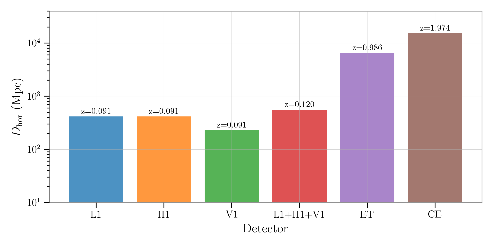

# Horizon Distance

The **horizon distance**, denoted $D_{\rm hor}$, is a key metric for assessing the sensitivity of a gravitational-wave detector or network. It is defined as the maximum luminosity distance at which a specific GW source can be reliably detected, i.e., where its signal-to-noise ratio (SNR) meets or exceeds a given threshold, typically $\rho_{\rm th} = 8$.

This distance is computed under the optimal scenario: the source is directly overhead and face-on with respect to the detector(s), providing the strongest possible signal. The `gwsnr` package offers two approaches for calculating the horizon distance: an **analytical scaling method** and a **numerical root-finding method**.

## 1. Analytical Method

The analytical approach calculates the horizon distance by scaling a known SNR measurement. For any generic inspiral–merger–ringdown (IMR) waveform, the horizon distance can be determined from the optimal SNR ($\rho_{\rm opt}$) at a given [effective distance](interpolation.md#mathematical-formulation) ($D_{\rm eff}$):

$$
\begin{align}
D_{\rm hor} &= \frac{\rho_{\rm opt}}{\rho_{\rm th}} D_{\rm eff}\, \tag{1}
\end{align}
$$

Notably, this approach does not require explicit optimization over sky location, as the dependence cancels between the SNR and the effective distance.

In `gwsnr`, $\rho_{\rm opt}$ is computed using the core functionalities, such as the noise-weighted inner product or the Partial Scaling interpolation method. The package also includes a JIT-compiled function for efficient evaluation of $D_{\rm eff}$.

This general formula in Eq.(1) is rooted in the work of [Allen et al. (2012)](https://arxiv.org/pdf/gr-qc/0509116), which provides a specific analytical expression for simple inspiral waveforms:

$$
\begin{align}
D_{\rm hor} &= \left( \frac{1~\mathrm{Mpc}}{\rho_{\rm th}} \right) \mathcal{A}_{1~\mathrm{Mpc}}(\mathcal{M}) \sqrt{ 4 \int_{f_{\rm min}}^{f_{\rm max}} \frac{f^{-7/3}}{S_n(f)}\,df }, \tag{2}
\end{align}
$$

where $\mathcal{M}$ is the chirp mass, and $\mathcal{A}_{1~\mathrm{Mpc}}$ denotes the waveform's intrinsic amplitude at a distance of 1 Mpc. While Eq.(1) was originally derived for simple inspiral signals, it remains applicable to general IMR waveforms dominated by the quadrupolar (2,2)-mode, provided an appropriate waveform model is used to compute $\rho_{\rm opt}$.

<!-- ## 1. Analytical Method

The analytical approach calculates the horizon distance by scaling a known SNR measurement. For any generic inspiral–merger–ringdown (IMR) waveform, the horizon distance can be determined from the optimal SNR ($\rho_{\rm opt}$) at a given [effective distance](interpolation.md#mathematical-formulation) ($D_{\rm eff}$):

$$
\begin{align}
D_{\rm hor} &= \frac{\rho_{\rm opt}}{\rho_{\rm th}} D_{\rm eff}\, \tag{1}
\end{align}
$$

Notably, this approach does not require explicit optimization over sky location, as the dependence cancels between the SNR and the effective distance.

In `gwsnr`, $\rho_{\rm opt}$ is computed using the core functionalities, such as the noise-weighted inner product or the Partial Scaling interpolation method. The package also includes a JIT-compiled function for efficient evaluation of $D_{\rm eff}$.

This general formula in Eq.(1) is based on the foundational work of [Allen et al. (2012)](https://arxiv.org/pdf/gr-qc/0509116), which provides a specific analytical expression for simple inspiral waveforms:

$$
D_{\rm hor} = \left( \frac{1~\mathrm{Mpc}}{\rho_{\rm th}} \right) \mathcal{A}_{1~\mathrm{Mpc}}(\mathcal{M}) \sqrt{ 4 \int_{f_{\rm min}}^{f_{\rm max}} \frac{f^{-7/3}}{S_n(f)}\,df }
$$

Here, $\mathcal{M}$ is the chirp mass, and $\mathcal{A}_{1\~\mathrm{Mpc}}$ denotes the waveform's intrinsic amplitude at a distance of 1 Mpc. Although Eq.(1) is originally derived for simple inspiral waveforms, it can be extended to more general IMR waveforms—provided the analysis is restricted to quadrupole order and dominated by the (2,2)-mode—by employing the appropriate waveform models and calculating the corresponding $\rho_{\rm opt}$.

--- -->

## 2. Numerical Method

The numerical method directly determines the horizon distance by finding the specific distance at which the SNR matches the detection threshold. This involves two main steps:

* **Optimization:** For a given set of relevant GW parameters (masses, spins, phase, etc.), `gwsnr` first finds the optimal sky location (for each detector) that maximize the SNR, providing the best-case SNR for that source type at a reference distance.

* **Root-Finding:** With the optimal configuration fixed, the algorithm then numerically solves for the luminosity distance, $D_L$, that satisfies the equation:

  $$
  F(D_L) = \rho(D_L) - \rho_{\rm th} = 0
  $$

This approach is also applicable to a network of detectors, in which case the optimal sky location is found for the detector network, where the single-detector SNR, $\rho$, is replaced by the network SNR, $\rho_{\rm net}$, and then the root-finding is performed to find the distance at which $\rho_{\rm net} = \rho_{\rm th}$.


## Example Usage

```python
# loading GWSNR class from the gwsnr package
from gwsnr import GWSNR

# initializing the GWSNR class with default configuration and interpolation method
gwsnr = GWSNR(mtot_min=2., mtot_max=6.)

# 1. Analytical Method
d_hor_analytical = gwsnr.horizon_distance_analytical(mass_1=1.4, mass_2=1.4)

# 2. Numerical Method
d_hor_numerical, _, _ = gwsnr.horizon_distance_numerical(mass_1=1.4, mass_2=1.4)

# print the type of the SNRs
print(f"horizon distance (analytical): {d_hor_analytical} Mpc")
print(f"horizon distance (numerical): {d_hor_numerical} Mpc")
```

```
horizon distance (analytical): {'L1': array([416.49490771]), 'H1': array([416.49490771]), 'V1': array([317.93916075])} Mpc
horizon distance (numerical): {'L1': 416.49483499582857, 'H1': 416.4948722301051, 'V1': 228.76581222284585, 'optimal_snr_net': 557.9508489044383} Mpc
```

## Horizon Distance BNS Systems across various Detectors

<figure>
  
  <figcaption>
    <b>Figure.</b> Horizon distance ($D_{\rm hor}$) for binary neutron star (BNS) systems across various detectors. The bar heights show the maximum detection range (in Mpc, log scale) for the LIGO detectors (L1, H1, V1), their network (L1+H1+V1), and future third-generation observatories (Einstein Telescope, ET; Cosmic Explorer, CE). The annotated values indicate the corresponding redshift at each horizon distance, highlighting the enhanced reach of next-generation detectors.
  </figcaption>
</figure>


