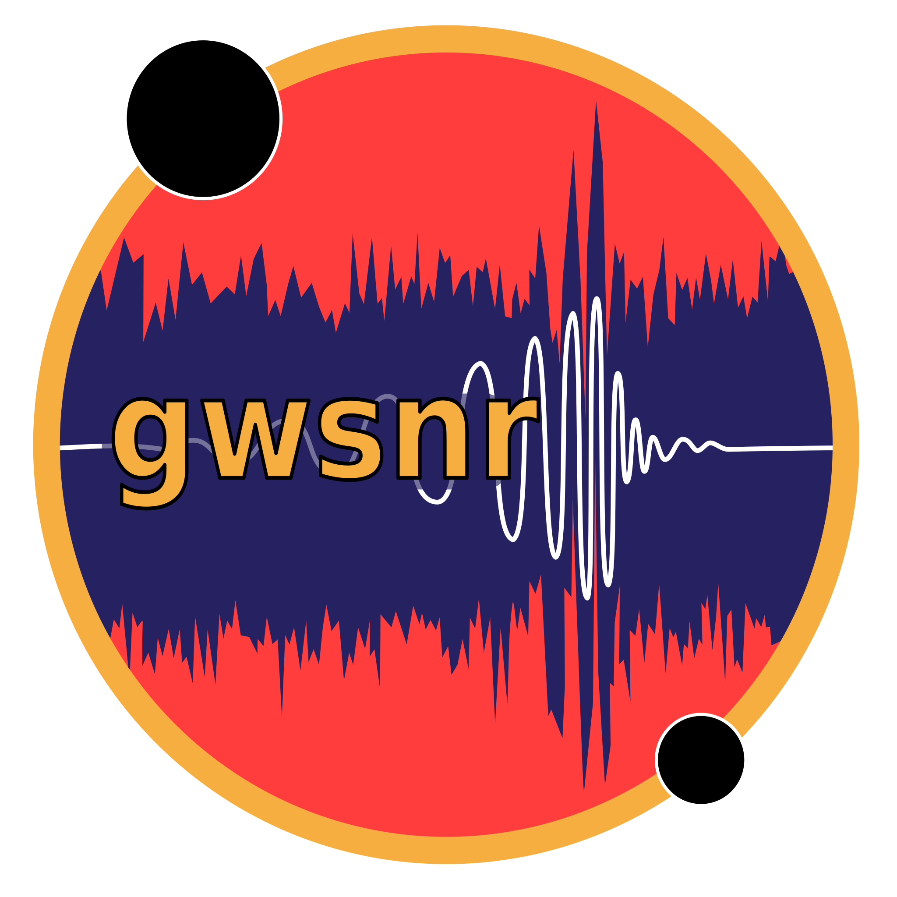

Welcome to gwsnr's documentation!
===============================

==================
gwsnr
==================

``gwsnr``: :red_first:`Gravitational` :red_first:`Wave` :red_first:`Signal`-to-:red_first:`Noise` :red_first:`Ratio` Computation Package

The ``gwsnr`` package is designed to facilitate efficient and accurate SNR computations in gravitational wave research. It implements advanced techniques for enhancing calculation speed and precision, making it a valuable tool for researchers in this field. Description available in :doc:`Summary` section.

| The code is available at `github.gwsnr <https://github.com/hemantaph/gwsnr>`_.
| For reaching out to the developer, please raise issue in `github.gwsnr.issue <https://github.com/hemantaph/gwsnr/issues>`_.

``gwsnr`` to integrate with `ler <https://ler.readthedocs.io/en/latest/>`_ package for simulating detectable gravitational wave signals.

| ``gwsnr`` main developer: `Hemanta Ph. <https://www.hemantaph.com>`_
| ``gwsnr`` developer and analyst: `Hemanta Ph. <https://www.hemantaph.com>`_, `Otto Akseli Hannuksela <https://www.oahannuksela.com/>`_.

Glossary
==================

.. glossary::
 
   Gravitational waves

      .. image:: _static/gw.gif
         :align: left
         :width: 480px
         :alt: ler logo

      *Animation showing the propagation of gravitational waves from inspiraling binary black holes.* 
      `Source <https://community.wolfram.com/groups/-/m/t/790989>`_ : Jeffrey Bryant, Wolfram|Alpha, LLC.

      |
      Ripples in the fabric of space-time caused by some of the most violent and energetic processes in the Universe, such as merger of compact binaries (e.g., black holes and neutron stars) and supernovae explosions. Albert Einstein predicted the existence of gravitational waves in 1916 in his general theory of relativity, but it took a century to detect them directly. The first detection was made in 2015 by the LIGO and Virgo collaborations, which won the 2017 Nobel Prize in Physics. Gravitational waves are invisible, yet incredibly fast; they travel at the speed of light, squeezing and stretching anything in their path.

.. toctree::
   :maxdepth: 2
   :caption: Contents:

   Installation
   Codeoverview
   Summary
   innerproduct
   interpolation
   ann
   hybrid
   
.. toctree::
   :maxdepth: 2
   :caption: API:

   autoapi/gwsnr/core/index.rst
   autoapi/gwsnr/ann/index.rst
   autoapi/gwsnr/numba/index.rst
   autoapi/gwsnr/jax/index.rst
   autoapi/gwsnr/ripple/index.rst
   autoapi/gwsnr/utils/index.rst
   
.. toctree::
   :maxdepth: 2
   :caption: Examples:

   examples/snr_generation
   examples/model_generation

Indices and tables
==================

* :ref:`genindex`
* :ref:`modindex`
* :ref:`search`
