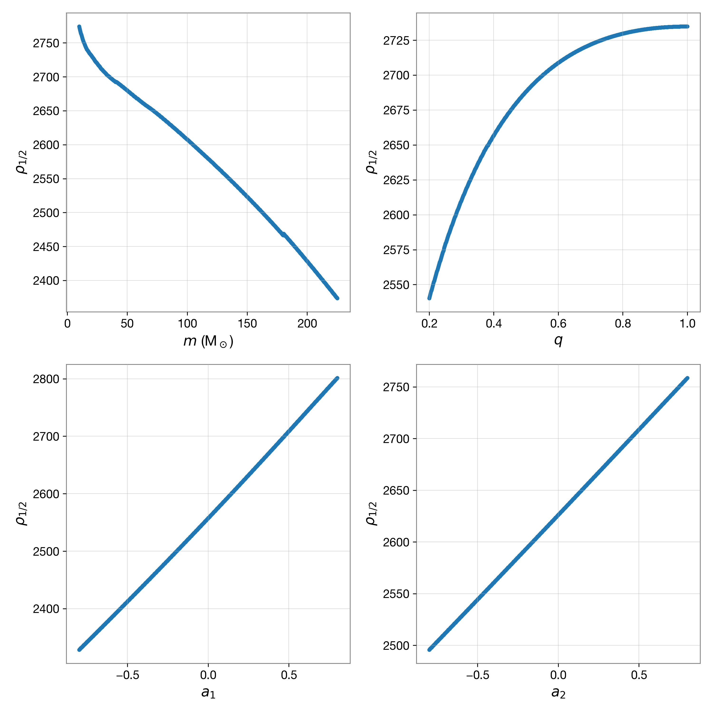
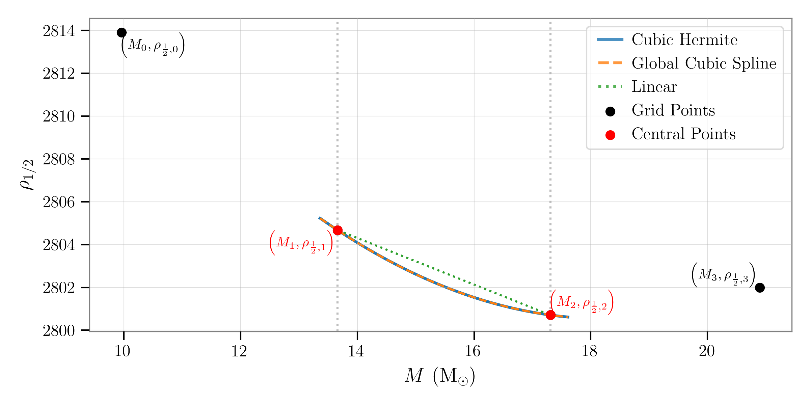
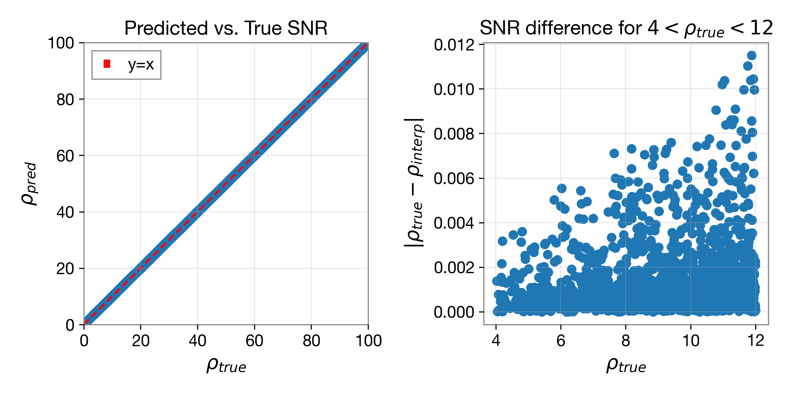

# The Partial Scaling Interpolation Method

The `gwsnr` package implements the Partial Scaling method, an interpolation-assisted technique designed for the rapid calculation of SNR of binary systems with non-spinning or aligned-spin components. Although originally conceived for simple inspiral-only waveforms, the method has since been generalized to include full inspiral-merger-ringdown (IMR; frequency domain) waveforms available in the [lalsimulation](https://lscsoft.docs.ligo.org/lalsuite/lalsimulation/modules.html) library. 

The core principle, adapted from the FINDCHIRP algorithm ([@Allen:2012](https://arxiv.org/pdf/gr-qc/0509116)), is to pre-compute and interpolate the most computationally expensive component of the SNR calculation—termed the "partial-SNR," denoted as $\rho_{\frac{1}{2}}$. This partial-SNR depends solely on the intrinsic parameters of the binary, such as total mass $M$, mass ratio $q$, and spin magnitudes $a_1$ and $a_2$. The final SNR is then quickly recovered through the application of a simple scaling factor. To further optimize performance, the entire procedure of interpolation, is accelerated using either `numba.njit` compilation or `jax.jit` compilation and further parralelized using `jax.vmap`.

## Mathematical Formulation

The Partial Scaling method begins with the standard definition of the optimal SNR, $\rho$. For a simple inspiral waveform, following Eq.(2) of the Sec.([Noise-Weighted Inner Product Method](https://gwsnr.readthedocs.io/en/latest/innerproduct.html)) and Eq.(D1) of [@Allen:2012](https://arxiv.org/pdf/gr-qc/0509116), the SNR can be written as

$$
\begin{align}
\rho &= \sqrt{4 \int_{f_{\rm min}}^{f_{\rm max}} \frac{|\tilde{h}(f)|^2}{S_n(f)}\, df}, \notag \\
&= \left( \frac{1~\mathrm{Mpc}}{D_{\mathrm{eff}}} \right)
\sqrt{4 \mathcal{A}_{1~\mathrm{Mpc}}^2 ({\cal M})
\int_{f_{\rm min}}^{f_{\rm max}} \frac{f^{-7/3}}{S_n(f)}\, df }, \notag \\
&= \left(\frac{1~\mathrm{Mpc}}{D_{\mathrm{eff}}}\right) \mathcal{A}_{1~\mathrm{Mpc}} ({\cal M}) \sqrt{ 4\int_{f_{\rm min}}^{f_{\rm lso}} \frac{f^{-7/3}}{S_n(f)}df }, \tag{1}
\end{align}
$$

where $\tilde{h}(f)$ is the frequency-domain waveform, $S_n(f)$ is the detector noise power spectral density, and $D_{\text{eff}}$ is the effective distance to the source. The amplitude term, $\mathcal{A}_{1,\text{Mpc}}$, is a function of the chirp mass ${\cal M}$. Now, $D_{\text{eff}}$ and $\mathcal{A}_{1,\text{Mpc}}$ reads

$$
\begin{align}
\mathcal{A}_{\rm 1Mpc} &= \left(\frac{5}{24\pi}\right)^{\frac{1}{2}}
\left(\frac{GM_\odot/c^2}{1~\mathrm{Mpc}}\right)
\left(\frac{\pi GM_\odot}{c^3}\right)^{-1/6}
\left(\frac{\mathcal{M}}{M_\odot}\right)^{5/6} \,,\tag{2} \\
D_\mathrm{eff} &= D_l \left[
F_+^2 \left(\frac{1+\cos^2\iota}{2}\right)^2 +
F_\times^2 \cos^2\iota
\right]^{-\frac{1}{2}}.\tag{3} \\
\end{align}
$$

$\mathcal{M}$ is the chirp mass, and in terms of ($M,q$) it reads $\mathcal{M} = M \left( \frac{q}{1+q^2} \right)^{3/5}$, where $M = m_1 + m_2$ is the total mass and $q = m_2/m_1$ is the mass ratio. 
$D_l$ is the luminosity distance, $\iota$ is the inclination angle, and $F_+$ and $F_\times$ are the antenna patterns of the detector.
The integral runs from a minimum frequency $f_{\min}$ (typically $20$ Hz) up to the frequency of the last stable orbit, which is determined by the total mass of the binary system as $f_{\rm lso} = 1/(6^{3/2} \pi) (G\,M/c^3)^{-\frac{1}{2}}$. 

A key insight is to isolate the computationally intensive integral, which is independent of extrinsic parameters such as distance, inclination angle, and sky location. This term is defined as the partial-SNR, $\rho_{\frac{1}{2}}$ and it reads

$$
\begin{align}
\rho_{\frac{1}{2}} &= \left(\frac{D_\mathrm{eff}}{1~\mathrm{Mpc}}\right) \left(\frac{\mathcal{M}}{M_\odot}\right)^{-5/6} \times \rho\,, \tag{4}\\
&= \left(\frac{5}{24\pi}\right)^{-\frac{1}{2}}
\left(\frac{GM_\odot/c^2}{1~\mathrm{Mpc}}\right)^{-1}
\left(\frac{\pi GM_\odot}{c^3}\right)^{1/6}
\sqrt{4 \int_{20}^{f_{\rm LSO}} \frac{f^{-7/3}}{S_n(f)}\, df} \tag{5}
\end{align}
$$

For more general IMR waveforms the same principle applies. The full SNR, $\rho_{\text{bilby}}$, is first calculated using a library such as `bilby`, and the partial-SNR is analogously defined as

$$
\begin{align}
\rho_{\frac{1}{2}} &= \frac{D_\mathrm{eff}}{\mathcal{M}^{5/6}} \times \rho_{\rm full}\,, \tag{6}
\end{align}
$$

Here I assume $D_\mathrm{eff}$ and $\mathcal{M}$ are in the units of Mpc and $M_\odot$, respectively, so that $\rho_{\frac{1}{2}}$ is dimensionless. Through numerical analysis (see the section on [Why interpolation is possible?](#why-interpolation-is-possible)), the partial-SNR $\rho_{\frac{1}{2}}$ turns out to be a smooth function of the intrinsic parameters of the binary system, such as total mass $M$ and mass ratio $q$ for non-spinning systems, and additional spin magnitudes $a_1$ and $a_2$ for spin-aligned systems. This allows us to pre-compute $\rho_{\frac{1}{2}}$ for a grid of binary parameters, which can then be efficiently interpolated for new parameter sets.

## Why interpolation is possible?

Interpolation is feasible for frequency-domain IMR waveforms restricted to the dominant (2,2)-mode because the partial-SNR exhibits smooth and continuous dependence on the binary's intrinsic parameters. As demonstrated in the figure below, the partial-SNR varies smoothly with total mass $M$, mass ratio $q$, and spin magnitudes $a_1$ and $a_2$. This continuous behavior enables accurate interpolation across the parameter space defined by the pre-computed grid. Importantly, for this class of waveforms, the partial-SNR depends only on intrinsic parameters and remains independent of extrinsic parameters such as luminosity distance, inclination angle, and sky location.

<figure align="center">
  
  <figcaption align="left">
    <b>Figure.</b> Partial SNR ρ<sub>1/2</sub> as a function of intrinsic parameters for aligned-spin IMRPhenomD waveforms. The four panels demonstrate the smooth variation of ρ<sub>1/2</sub> with respect to total mass M, mass ratio q, and spin magnitudes a<sub>1</sub> and a<sub>2</sub>, with other parameters held constant. The continuous and monotonic behavior enables accurate interpolation across the parameter space.
  </figcaption>
</figure>

Spin-precessing systems, with higher harmonics, the relationship is not as smooth, and interpolation may not yield accurate results. In such cases, the noise-weighted inner product method is recommended.

## Interpolation Procedure

To obtain the SNR for a new set of binary parameters, the method interpolates $\rho_{\frac{1}{2}}$ from a pre-computed grid. 
For non-spinning IMR waveforms, a two-dimensional grid in $(M, q)$ is constructed, with grid spacing optimized to minimize interpolation error: the $q$ axis is logarithmically spaced, while the $M$ axis is inverse-logarithmically spaced. Given a new parameter set $(M_{\text{new}}, q_{\text{new}})$, [nested one-dimensional cubic spline interpolation](https://gwsnr.readthedocs.io/en/latest/interpolation.html#nested-1d-cubic-spline-interpolation) is used to determine the corresponding value of $\rho_{\frac{1}{2}}$ from the pre-computed grid.

For spin-aligned IMR waveforms, the approach is extended to a four-dimensional grid spanning $(M, q, a_1, a_2)$, where $a_1$ and $a_2$ are the dimensionless spin magnitudes. The $(M, q)$ axes maintain the optimized spacing, while the spin axes are uniformly spaced within a user-defined range.

Once the interpolated value of $\rho_{\frac{1}{2}}$ is obtained, the final optimal SNR is simply recovered by scaling with the chirp mass and effective distance:

$$
\begin{align}
\rho = \rho_{\frac{1}{2}} \times \frac{\mathcal{M}^{5/6}}{D_\mathrm{eff}} \, .\tag{7}
\end{align}
$$

This methodology facilitates rapid and precise SNR evaluation throughout the entire parameter space relevant to gravitational wave detection. The implementation achieves high computational efficiency by employing just-in-time (JIT) compilation via `numba.njit`, or alternatively, by utilizing `jax.jit` in conjunction with vectorization through `jax.vmap`. This dual-backend design enables flexible deployment, supporting both multi-threaded parallelization on CPUs and GPU acceleration. As a result, large-scale SNR computations can be conducted with minimal computational overhead, making the approach well suited for demanding gravitational wave data analysis applications.

## Nested 1D Cubic Spline Interpolation

The Partial Scaling method relies on nested one-dimensional (1D) cubic spline interpolation (see [Interpolating with Cubic Hermite Splines](#interpolating-with-cubic-hermite-splines)) to efficiently estimate the partial-SNR, for a new set of binary parameters. This hierarchical approach avoids the complexity of multi-dimensional spline fitting by applying a sequence of 1D interpolations across each parameter dimension.

To illustrate the process, consider the 2D case for a non-spinning system with a pre-computed grid of $\rho_{\frac{1}{2}}$ values over $M$ and $q$ parameter space. The interpolation proceeds in several key steps. First, the axis arrays for $M$ and $q$ are obtained, and the precomputed $\rho_{\frac{1}{2}}$ values are loaded from a pickle file. These $\rho_{\frac{1}{2}}$ values are defined for each $(M, q)$ pair on the grid.

Given a new set of binary parameters $(M_{\rm new}, q_{\rm new})$, the next step is to identify the four nearest neighboring points along each axis: for $M$, the points $[M_{i-1}, M_i, M_{i+1}, M_{i+2}]$ are selected such that $M_i \leq M_{\rm new} \leq M_{i+1}$; similarly, for $q$, the points $[q_{j-1}, q_j, q_{j+1}, q_{j+2}]$ are chosen so that $q_j \leq q_{\rm new} \leq q_{j+1}$.

For each fixed value of $q$, a one-dimensional cubic spline interpolation is performed along the $M$ axis to estimate the values of $\rho_{\frac{1}{2}}$ at $M_{\rm new}$. This process yields a set of four intermediate values, corresponding to $q_{j-1}$, $q_j$, $q_{j+1}$, and $q_{j+2}$:

$$
\left[ \rho_{\frac{1}{2}}(q_{j-1}, M_{\rm new}),\, \rho_{\frac{1}{2}}(q_j, M_{\rm new}),\, \rho_{\frac{1}{2}}(q_{j+1}, M_{\rm new}),\, \rho_{\frac{1}{2}}(q_{j+2}, M_{\rm new}) \right].
$$

A subsequent cubic spline interpolation is then carried out along the $q$ axis, using these values, to determine the final interpolated result $\rho_{\frac{1}{2}}(M_{\rm new}, q_{\rm new})$.


<!-- <figure align="center">
  
</figure> -->

<div class="centered">
  <iframe src="_static/nested_interpolation.html"
        width="600"
        height="600"
        frameborder="0"
        allowfullscreen
        style="border:1px solid #ccc; border-radius:10px;"></iframe>

  <figcaption align="center" style="padding: 2%;">
    <b>Figure.</b> Nested 1D cubic spline interpolation 
  </figcaption>
</div>


For the spin-aligned IMR waveform, the methodology is conceptually identical but operates in a four-dimensional grid spanning $(M, q, a_1, a_2)$. The interpolation follows a hierarchical scheme, beginning with the $a_1$ and $a_2$ axes, followed by $M$, and finally $q$, recursively applying the one-dimensional cubic spline interpolation at each stage until the final value, $\rho_{\frac{1}{2}}(M_{\rm new}, q_{\rm new}, a_{1, \rm new}, a_{2, \rm new})$, is obtained.

In the presence of edge cases—particularly when the target parameter lies near or beyond the boundaries of the precomputed grid—the methodology employs a robust fallback: the nearest available value of $\rho_{\frac{1}{2}}$ is utilized. Specifically, if $M_{\rm new} < M_1$ (or $M_0$), where $M_0$ and $M_1$ represent the first and second points along the $M$ axis, the scheme resorts to simple linear interpolation (or extrapolation) based on these initial grid points. This approach ensures both the stability and consistency of the interpolation procedure, even at or outside the defined limits of the parameter space.

## Interpolating with Cubic Hermite Splines

The core algorithm for the nested 1D interpolation described previously is the [cubic Hermite spline](https://en.wikipedia.org/wiki/Cubic_Hermite_spline). This technique constructs a piecewise cubic polynomial that ensures continuity of both the function values and their first derivatives at the grid points. Unlike a global spline fit, which can be computationally intensive, Hermite interpolation is a local method. It only requires information from the immediate neighbors of an interval, making it highly efficient and particularly well-suited for non-uniformly spaced data. This approach offers a significant accuracy improvement over simple linear interpolation by capturing the local curvature of the data.

<figure  align="center">
  
    <figcaption align="left" style="padding: 0 5%;">
      <b>Figure.</b> Cubic Hermite interpolation of the partial SNR, $\rho_{\frac{1}{2}}$, along the mass axis for a fixed binary configuration ($q = 0.183$, $a_1 = 0.99$, $a_2 = 0.99$), demonstrating the method’s effectiveness compared to global cubic spline and linear interpolation. The solid blue curve shows the cubic Hermite interpolant constructed using the two central masses ($M_1, M_2$) and endpoint derivatives estimated via a finite difference formula on all four grid points ($M = [9.96,\, 13.66,\, 17.31,\, 20.90]$), which is robust for non-uniform spacing. For reference, the dashed orange curve is the global cubic spline through all points, and the green dotted segment shows simple linear interpolation between the central points. Black circles mark the grid data, with red points indicating the Hermite interval boundaries. While linear interpolation cannot capture the underlying SNR trend between grid points, the cubic Hermite method provides a smooth and locally accurate estimate by matching both value and slope at the endpoints, closely following the physical variation of SNR across the mass parameter space.
    </figcaption>
</figure>

### Methodology

Consider interpolation along the $M$-axis while keeping $q$, $a_1$, and $a_2$ fixed. To interpolate the partial SNR, $\rho_{\frac{1}{2}}$, at an arbitrary mass $M_{\text{new}}$, we use four neighboring grid points: $(M_0, \rho_{\frac{1}{2},0})$, $(M_1, \rho_{\frac{1}{2},1})$, $(M_2, \rho_{\frac{1}{2},2})$, and $(M_3, \rho_{\frac{1}{2},3})$, where $M_1 \leq M_{\text{new}} \leq M_2$.

The objective is to estimate $\rho_{\frac{1}{2}}(M_{\text{new}})$ by constructing a cubic polynomial that smoothly connects the two central grid points $M_1$ and $M_2$. To work with a standardized interval, we introduce a normalized variable $t$ that maps the physical interval $[M_1, M_2]$ to the computational interval $[0, 1]$:

$$
t = \frac{M_{\text{new}} - M_1}{M_2 - M_1}
$$

The cubic polynomial is written as:

$$
\rho_{\frac{1}{2}}(t) = \alpha_0 + \alpha_1 t + \alpha_2 t^2 + \alpha_3 t^3
$$

To determine the coefficients $(\alpha_0, \alpha_1, \alpha_2, \alpha_3)$, four constraints are imposed:

* The interpolant passes through the central points:
  - $\rho_{\frac{1}{2}}(M_1) = \alpha_0 = \rho_{\frac{1}{2}, 1}$
  - $\rho_{\frac{1}{2}}(M_2) = \alpha_0 + \alpha_1 + \alpha_2 + \alpha_3 = \rho_{\frac{1}{2}, 2}$

* The derivatives at the endpoints are set by the slopes at the central points:
  - $\rho_{\frac{1}{2}}'(M_1) = s_1$
  - $\rho_{\frac{1}{2}}'(M_2) = s_2$

Since the true derivatives are generally unknown, they are estimated using a [finite difference formula](https://en.wikipedia.org/wiki/Finite_difference) involving the two points surrounding the interval, $M_0$ and $M_3$:

**Slope at $M_1$:**

$$
s_1 = \left(\frac{M_2 - M_1}{M_2 - M_0}\right) \frac{\rho_2 - \rho_1}{M_2 - M_1}
   + \left(\frac{M_1 - M_0}{M_2 - M_0}\right) \frac{\rho_1 - \rho_0}{M_1 - M_0}
$$

**Slope at $M_2$:**

$$
s_2 = \left(\frac{M_2 - M_1}{M_3 - M_1}\right) \frac{\rho_2 - \rho_1}{M_2 - M_1}
   + \left(\frac{M_3 - M_2}{M_3 - M_1}\right) \frac{\rho_3 - \rho_2}{M_3 - M_2}
$$

This formulism uses a three-point finite difference scheme to estimate the derivatives at the interval endpoints, $M_1$ and $M_2$. Each derivative is computed as a weighted average of the slopes of the two adjacent intervals. This local approximation is computationally efficient, as it avoids solving a larger system of equations that would be necessary for a global spline fit (see [cubic spline fit for data points](https://blog.timodenk.com/cubic-spline-interpolation/)), yet it provides sufficient accuracy for smooth data.

With the values and estimated slopes, the coefficients can be directly calculated. Let $h = M_2 - M_1$:

$$
\begin{align*}
\alpha_0 &= \rho_1 \\
\alpha_1 &= h \cdot s_1 \\
\alpha_2 &= 3(\rho_2 - \rho_1) - h (2s_1 + s_2) \\
\alpha_3 &= 2(\rho_1 - \rho_2) + h (s_1 + s_2)
\end{align*}
$$

Plugging these coefficients into the polynomial provides the interpolated value at $M_{\text{new}}$.

**Summary:**
Cubic Hermite interpolation combines accuracy, efficiency, and robustness, and is particularly effective for smoothly interpolating non-uniform data using local grid information and endpoint slopes estimated by finite differences.


## Example Usage

```python
# loading GWSNR class from the gwsnr package
from gwsnr import GWSNR
import numpy as np

# initializing the GWSNR class with default configuration and interpolation method
# for aligned-spinning IMRPhenomD waveform
gwsnr_aligned_spins = GWSNR(
    npool=8,
    snr_method='interpolation_aligned_spins', # or 'interpolation_aligned_spins_jax'
    gwsnr_verbose=False,
)

nsamples = 50000
mtot = np.random.uniform(2*4.98, 2*112.5,nsamples)
mass_ratio = np.random.uniform(0.2,1,size=nsamples)
param_dict = dict(
    # convert to component masses
    mass_1 = mtot / (1 + mass_ratio), # in solar masses
    mass_2 = mtot * mass_ratio / (1 + mass_ratio), # in solar masses
    luminosity_distance = np.random.uniform(10,10000, size=nsamples), # in Mpc
    theta_jn = np.random.uniform(0,2*np.pi, size=nsamples), # inclination angle in radians
    ra = np.random.uniform(0,2*np.pi, size=nsamples),  # right ascension in radians
    dec = np.random.uniform(-np.pi/2,np.pi/2, size=nsamples),  # declination in radians
    psi = np.random.uniform(0,2*np.pi, size=nsamples), # polarization angle in radians
    phase = np.random.uniform(0,2*np.pi, size=nsamples), # coalescence phase in radians
    geocent_time = 1246527224.169434*np.ones(nsamples), # geocentric time in GPS seconds
    a_1 = np.random.uniform(-0.8,0.8, size=nsamples), # dimensionless spin of the primary black hole
    a_2 = np.random.uniform(-0.8,0.8, size=nsamples), # dimensionless spin of the secondary black hole
)

interp_snr_aligned_spins = gwsnr_aligned_spinsoptimal_snr(gw_param_dict=param_dict) # or gwsnr_aligned_spinsoptimal_snr(**param_dict)

print(interp_snr_aligned_spins)
```

**Expected Output:**
```
{'L1': array([ 0.32863562, 12.80466615,  4.64289071, ...,  9.40759371,
       18.66322763,  3.73022863]), 'H1': array([ 0.90286756, 15.01545159,  5.19427481, ..., 11.65219727,
       23.79538297,  5.33905121]), 'V1': array([ 1.85612149, 12.78743709,  2.20533615, ...,  9.99559578,
       17.89409329,  1.94768776]), 'snr_net': array([ 2.09006176, 23.51471473,  7.30755995, ..., 18.00523412,
       35.13879467,  6.79805569])}
```

## Accuracy

The Partial Scaling method achieves excellent accuracy, even with a moderately sized pre-computed grid. For a grid of $\rho_{1/2}$ values with dimensions 20x200x10x10 over the parameters $(q, M, a_1, a_2)$, the interpolated SNR shows a mean percentage difference of just 0.01% when compared to the true values from `bilby`. The maximum deviation is only 0.53%, with a standard deviation of 0.02%, confirming the method's consistent precision across the parameter space.


<figure  align="center">
  
    <figcaption align="left" style="padding: 0 5%;">
    <b>Figure.</b> Comparison of the predicted SNR using the Partial Scaling method (interpolation) against the true SNR from the Bilby library for aligned-spin IMRPhenomD waveforms. The close agreement demonstrates the effectiveness of the interpolation approach.
  </figcaption>
</figure>

Note that the accuracy can be further improved by increasing the grid resolution, but the current configuration already provides an excellent balance between speed and precision.

## Performance: Numba vs. JAX in the Partial Scaling Method

The efficiency of `gwsnr` is significantly enhanced by its Just-In-Time (JIT) compilation backends: Numba and JAX. Both options dramatically accelerate SNR calculations with the Partial Scaling Interpolation Method compared to standard Inner Product Methods.

To quantify the performance, we benchmarked the time required to compute SNR for one million aligned-spin samples. Inner Product Methods take approximately 6-14 minutes on a multi-core CPU. In contrast, the JIT backends complete the same task in seconds or even milliseconds, as summarized below:

| Method / Backend         | Execution Time (1M Samples) | Notes                                      |
|--------------------------|----------------------------|--------------------------------------------|
| Standard Python (No JIT) | ~6-14 minutes              | Baseline performance on 1-8 CPU cores     |
| Numba (CPU)              | 2.12 s                     | Uses `@njit` and `prange` for parallelization |
| JAX (CPU)                | 1.48 s                     | Uses `jit` and `vmap` for efficient vectorization |
| JAX (GPU)                | 88.9 ms                    | **Recommended**. Over 15× faster than CPU JAX |

Both JIT backends offer substantial speedup over standard Python implementations. While JAX holds a slight performance advantage on CPUs, its true power is unlocked on compatible GPUs (benchmark performed on NVIDIA GeForce RTX 3080). For users seeking maximum performance in large-scale computations, the JAX backend with GPU acceleration is the recommended choice.

**Remark:** Since the start of the project, from the calculation of SNR with `bilby`, using `gwsnr` leads to x100000 improvement in speed, and it took 2 years to achieve this performance boost.