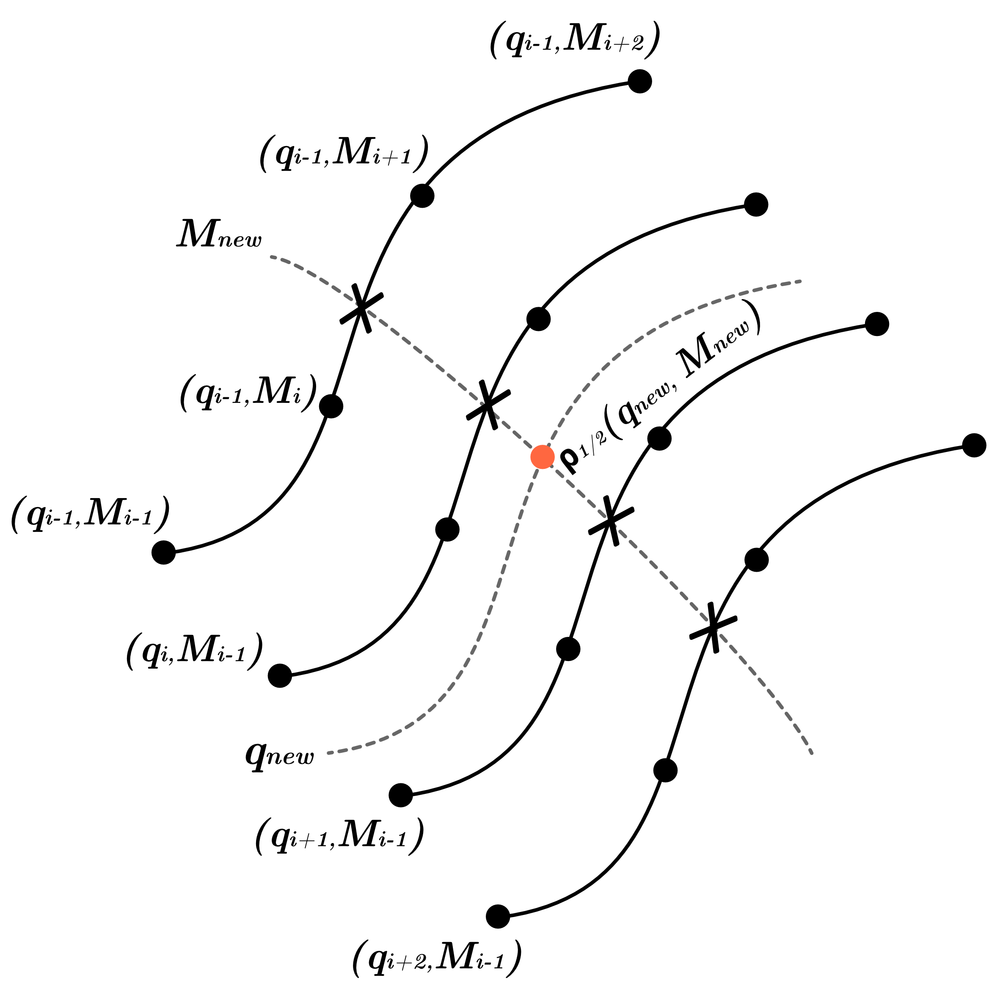

# The Partial Scaling Interpolation Method

The `gwsnr` package implements the Partial Scaling method, an interpolation-assisted technique designed for the rapid calculation of SNR of binary systems with non-spinning or aligned-spin components. Although originally conceived for simple inspiral-only waveforms, the method has since been generalized to include full inspiral-merger-ringdown (IMR; frequency domain) waveforms available in the `lalsimulation` library. 

The core principle, adapted from the FINDCHIRP algorithm ([@Allen:2012](https://arxiv.org/pdf/gr-qc/0509116)), is to pre-compute and interpolate the most computationally expensive component of the SNR calculation—termed the "partial SNR," denoted as $\rho_{1/2}$. This partial SNR depends solely on the intrinsic parameters of the binary, such as total mass $M$, mass ratio $q$, and spin magnitudes $a_1$ and $a_2$. The final SNR is then quickly recovered through the application of a simple scaling factor. To further optimize performance, the entire procedure, including both antenna response computations and interpolation, is accelerated using either `numba.njit` compilation or `jax.jit` compilation and further parralelized using `jax.vmap`.

## Mathematical Formulation

The Partial Scaling method begins with the standard definition of the optimal SNR, $\rho$. For a simple inspiral waveform, following Eq.(2) of the Sec.([II](#ii-noise-weighted-inner-product-method)) and Eq.(D1) of [@Allen:2012](https://arxiv.org/pdf/gr-qc/0509116), the SNR can be written as

$$
\begin{align}
\rho &= \sqrt{4 \int_{f_{\rm min}}^{f_{\rm max}} \frac{|\tilde{h}(f)|^2}{S_n(f)}\, df}, \notag \\
&= \left( \frac{1~\mathrm{Mpc}}{D_{\mathrm{eff}}} \right)
\sqrt{4 \mathcal{A}_{1~\mathrm{Mpc}}^2 ({\cal M})
\int_{f_{\rm min}}^{f_{\rm max}} \frac{f^{-7/3}}{S_n(f)}\, df }, \notag \\
&= \left(\frac{1~\mathrm{Mpc}}{D_{\mathrm{eff}}}\right) \mathcal{A}_{1~\mathrm{Mpc}} ({\cal M}) \sqrt{ 4\int_{f_{\rm min}}^{f_{\rm lso}} \frac{f^{-7/3}}{S_n(f)}df }, \tag{1}
\end{align}
$$

where $\tilde{h}(f)$ is the frequency-domain waveform, $S_n(f)$ is the detector noise power spectral density, and $D_{\text{eff}}$ is the effective distance to the source. The amplitude term, $\mathcal{A}_{1,\text{Mpc}}$, is a function of the chirp mass ${\cal M}$. Now, $D_{\text{eff}}$ and $\mathcal{A}_{1,\text{Mpc}}$ reads

$$
\begin{align}
\mathcal{A}_{\rm 1Mpc} &= \left(\frac{5}{24\pi}\right)^{1/2}
\left(\frac{GM_\odot/c^2}{1~\mathrm{Mpc}}\right)
\left(\frac{\pi GM_\odot}{c^3}\right)^{-1/6}
\left(\frac{\mathcal{M}}{M_\odot}\right)^{5/6} \,,\tag{2} \\
D_\mathrm{eff} &= D_l \left[
F_+^2 \left(\frac{1+\cos^2\iota}{2}\right)^2 +
F_\times^2 \cos^2\iota
\right]^{-1/2}\tag{3} \\
\end{align}
$$

$\mathcal{M}$ is the chirp mass, and in terms of ($M,q$) it reads $\mathcal{M} = M \left( \frac{q}{1+q^2} \right)^{3/5}$, where $M = m_1 + m_2$ is the total mass and $q = m_2/m_1$ is the mass ratio. 
$D_l$ is the luminosity distance, $\iota$ is the inclination angle, and $F_+$ and $F_\times$ are the antenna patterns of the detector.
The integral runs from a minimum frequency $f_{\min}$ (typically $20$ Hz) up to the frequency of the last stable orbit, which is determined by the total mass of the binary system as $f_{\rm LSO} = 1/(6^{3/2} \pi) (G\,M/c^3)^{-1/2}$.

A key insight is to isolate the computationally intensive integral, which is independent of extrinsic parameters such as distance and sky location. This term is defined as the partial-SNR, $\rho_{1/2}$ and it reads

$$
\begin{align}
\rho_{1/2} &= \left(\frac{D_\mathrm{eff}}{1~\mathrm{Mpc}}\right) \mathcal{M}^{-5/6} \times \rho\,, \tag{4}\\
&= \left(\frac{5}{24\pi}\right)^{1/2}
\left(\frac{GM_\odot/c^2}{1~\mathrm{Mpc}}\right)
\left(\frac{\pi GM_\odot}{c^3}\right)^{-1/6}
\left(\frac{1}{M_\odot}\right)^{5/6}
\sqrt{4 \int_{20}^{f_{\rm LSO}} \frac{f^{-7/3}}{S_n(f)}\, df} \tag{5}
\end{align}
$$

For more general IMR waveforms the same principle applies. The full SNR, $\rho_{\text{bilby}}$, is first calculated using a library such as `bilby`, and the partial SNR is analogously defined as

$$
\begin{align}
\rho_{1/2} &= \left(\frac{D_\mathrm{eff}}{1~\mathrm{Mpc}}\right) \mathcal{M}^{-5/6} \times \rho_{\rm bilby}\,, \tag{6}
\end{align}
$$

## Interpolation Procedure

To obtain the SNR for a new set of binary parameters, the method interpolates $\rho_{1/2}$ from a pre-computed grid. 
For non-spinning IMR waveforms, a two-dimensional grid in $(M, q)$ is constructed, with grid spacing optimized to minimize interpolation error: the $q$ axis is logarithmically spaced, while the $M$ axis is inverse-logarithmically spaced. Given a new parameter set $(M_{\text{new}}, q_{\text{new}})$, **nested one-dimensional cubic spline interpolation** (see Sec.([IV](#iv-nested-1d-cubic-spline-interpolation))) is used to determine the corresponding value of $\rho_{1/2}$ from the pre-computed grid. These $\rho_{1/2}$ values are stored in a pickle file for efficient future access.

For spin-aligned IMR waveforms, the approach is extended to a four-dimensional grid spanning $(M, q, a_1, a_2)$, where $a_1$ and $a_2$ are the dimensionless spin magnitudes. The $(M, q)$ axes maintain the optimized spacing, while the spin axes are uniformly spaced within a user-defined range.

Once the interpolated value of $\rho_{1/2}$ is obtained, the final optimal SNR is simply recovered by scaling with the chirp mass and effective distance:

$$
\begin{align}
\rho = \rho_{1/2} \times \left( \frac{D_{\text{eff}}}{1~\mathrm{Mpc}} \right) \left( \frac{{\cal M}}{M_\odot} \right)^{5/6}.\tag{7}
\end{align}
$$

This methodology enables rapid and accurate SNR evaluation across the full parameter space relevant to gravitational wave detection.

## Nested 1D Cubic Spline Interpolation

The Partial Scaling method relies on nested one-dimensional (1D) cubic spline interpolation to efficiently estimate the partial SNR, $\rho_{1/2}$, for a new set of binary parameters. This hierarchical approach avoids the complexity of multi-dimensional spline fitting by applying a sequence of 1D interpolations across each parameter dimension.

### Interpolation for Non-Spinning Systems

To illustrate the process, consider the 2D case for a non-spinning system with a pre-computed grid of $\rho_{1/2}$ values over $M$ $q$ parameter space. The interpolation proceeds in several key steps. First, the axis arrays for $M$ and $q$ are obtained, and the precomputed $\rho_{1/2}$ values are loaded from a pickle file. These $\rho_{1/2}$ values are defined for each $(M, q)$ pair on the grid.

Given a new set of binary parameters $(M_{\rm new}, q_{\rm new})$, the next step is to identify the four nearest neighboring points along each axis: for $M$, the points $[M_{i-1}, M_i, M_{i+1}, M_{i+2}]$ are selected such that $M_i \leq M_{\rm new} \leq M_{i+1}$; similarly, for $q$, the points $[q_{j-1}, q_j, q_{j+1}, q_{j+2}]$ are chosen so that $q_j \leq q_{\rm new} \leq q_{j+1}$.

For each fixed value of $q$, a one-dimensional cubic spline interpolation is performed along the $M$ axis to estimate the value of $\rho_{1/2}$ at $M_{\rm new}$. This process yields a set of four intermediate values, corresponding to $q_{j-1}$, $q_j$, $q_{j+1}$, and $q_{j+2}$:

$$
\left[ \rho_{1/2}(q_{j-1}, M_{\rm new}),\, \rho_{1/2}(q_j, M_{\rm new}),\, \rho_{1/2}(q_{j+1}, M_{\rm new}),\, \rho_{1/2}(q_{j+2}, M_{\rm new}) \right].
$$

A subsequent cubic spline interpolation is then carried out along the $q$ axis, using these values, to determine the final interpolated result $\rho_{1/2}(M_{\rm new}, q_{\rm new})$.

For the spin-aligned IMR waveform, the methodology is conceptually identical but operates in a four-dimensional grid spanning $(M, q, a_1, a_2)$, where $a_1$ and $a_2$ are the dimensionless spin parameters. The interpolation follows a hierarchical scheme, beginning with the $a_1$ and $a_2$ axes, followed by $M$, and finally $q$, recursively applying the one-dimensional cubic spline interpolation at each stage until the final value, $\rho_{1/2}(M_{\rm new}, q_{\rm new}, a_{1, \rm new}, a_{2, \rm new})$, is obtained.

When dealing with edge cases—specifically, when the target value lies near or outside the bounds of the precomputed grid—a straightforward approach is adopted: the nearest available $\rho_{1/2}$ value is used. For example, if $M_{\rm new} < M_0$ or $M_{\rm new} < (M_1 - M_0)/2$, where $M_0$ and $M_1$ are the first and second entries of the $M$ axis, the interpolated value is set to $\rho_{1/2}(M_0, q_{\rm new})$. This ensures stability and consistency of the interpolation even at or beyond the boundaries of the parameter space.

## Catmull-Rom Spline Interpolation

`gwsnr` uses [Catmull-Rom spline interpolation](https://en.wikipedia.org/wiki/Centripetal_Catmull%E2%80%93Rom_spline) to compute the partial SNR, $\rho_{1/2}$, for a new set of binary parameters. This method is particularly effective for interpolating between pre-computed values in a grid, ensuring smooth transitions and accurate estimates. This interpolation technique is not as computationally intensive as the traditional cubic spline interpolation.

<!-- ### Mathematical Formulation

The Catmull spline is defined by four control points, which are used to compute the interpolated value at a given parameter. For a set of control points $P_0$, $P_1$, $P_2$, and $P_3$, the Catmull spline interpolation for a parameter $t$ (where $t$ is typically normalized between 0 and 1) is given by:
$$
P(t) = \frac{1}{2} \left[ (2P_1) + (-P_0 + P_2)t + (2P_0 - 5P_1 + 4P_2 - P_3)t^2 + (-P_0 + 3P_1 - 3P_2 + P_3)t^3 \right].
$$

This formula ensures that the curve passes through the points $P_1$ and $P_2$, while also being tangent to the segments defined by $P_0$ and $P_3$. The interpolation is smooth and continuous, making it suitable for applications where a high degree of accuracy is required. -->

