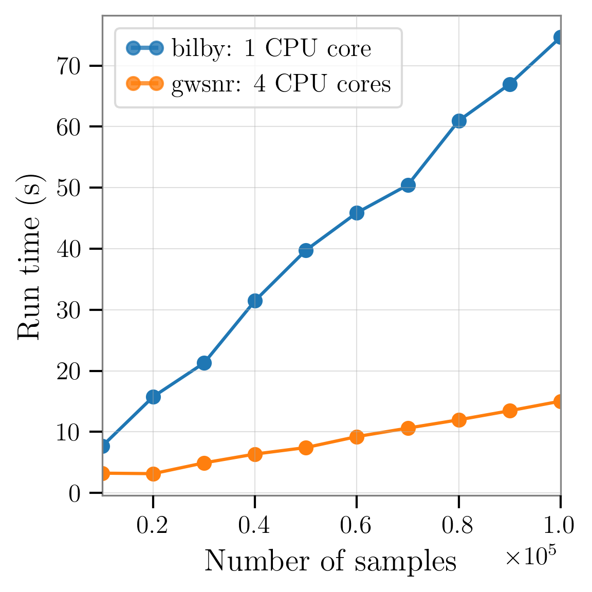
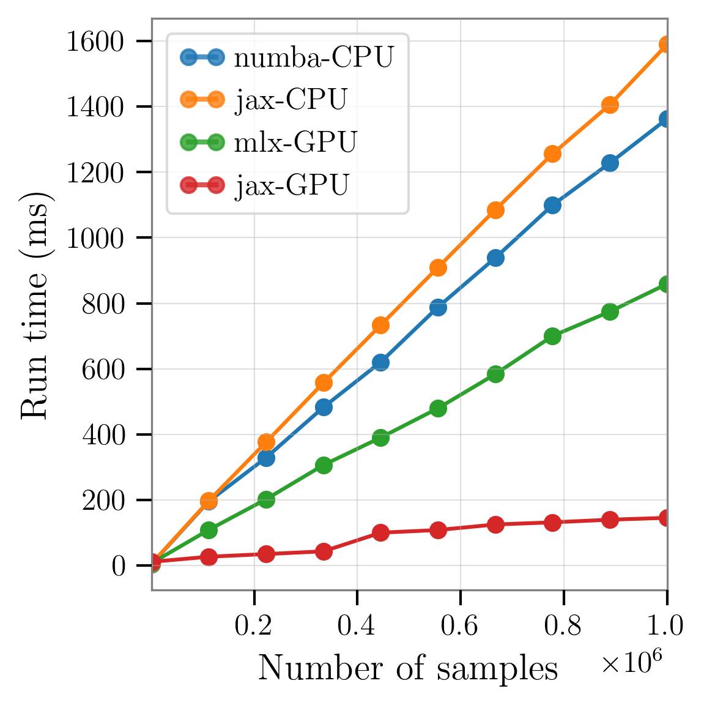

# Performance Summary

This summary showcases the significant computational performance of the `gwsnr` package compared to traditional methods like those in bilby. We benchmark two main computational techniques: the high-accuracy inner-product (or [noise weighted inner-product](https://gwsnr.readthedocs.io/en/latest/innerproduct.html)) method and the ultra-fast interpolation (or [partial-scaling interpolation](https://gwsnr.readthedocs.io/en/latest/interpolation.html)) method.

## Test Environment

Our benchmarks were run using two main configurations:

- **Config-1:** Performance benchmarks conducted using a fixed set of 100,000 astrophysically motivated waveform parameters for both Binary Black Hole (BBH) and Binary Neutron Star (BNS) systems, generated with the `ler` software package. BNS waveforms are significantly longer in duration than BBH waveforms, highlighting the performance benefits of `gwsnr` for extended-duration gravitational wave signals. Performance is benchmarked against `bilby`'s traditional optimal SNR computation method.

- **Config-2:** Scaling analysis using randomly sampled BBH events in 10 batches, ranging from 10,000 to 100,000 events for the inner-product method and up to 1,000,000 events for the interpolation method. All parameters are sampled using the same methodology as Config-1 to demonstrate how performance scales with increasing computational workloads, in a realistic astrophysical context.

## Inner-Product Performance

### Benchmark Results (100,000 Events)

The noise weighted inner-product is the foundation of the SNR calculation. `gwsnr`'s multi-core CPU architecture significantly reduces computation time compared to `bilby`'s single-core approach. `gwsnr` inner-product has optimization and utilizes `numba.njit` for just-in-time compilation of computationally intensive functions, including signal duration calculations, antenna response computations, and the inner-product calculation itself. The table below summarizes the performance comparison:

| Hardware Acceleration | Machine Specification | Time [s] (BBH, BNS) | Speedup vs.  `bilby`'s Inner-Product |
|:---|:---|:---:|:---:|
| **gwsnr (multi-core)** | Apple M2 Pro, 4 CPU cores | 16.652, 122.879 | 4x, <mark>4.8x</mark> |
| **bilby (single-core)** | Apple M2 Pro, 1 CPU core | 65.871, 443.625 | 1x, 1x |

Multi-core parallelization in `gwsnr` provides a significant advantage. While the speedup for the shorter BBH signal is evidently ~4x, from the use of 4 CPU cores, the performance gain for the long BNS waveform is over 4x.  It makes `gwsnr` an ideal choice for modest computation duration with high SNR accuracy.

### Performance Scaling

<figure align="center">
  
  <figcaption align="left">
  <b>Figure 1:</b> This plot compares the computational speed of the <code>gwsnr</code> package's inner-product implementation against the traditional SNR computation using <code>bilby</code>. The plot shows the run time (in seconds) required to evaluate an increasing number of parameter samples from 10000 to 100,000 BBH samples. The <code>bilby</code> benchmark was run on a single CPU core. In contrast, <code>gwsnr</code> leverages both multi-core processing (using four cores in this test) and just-in-time (JIT) compilation with <code>numba</code> to accelerate intensive calculations. The performance of <code>gwsnr</code> is also scalable and would improve further with additional CPU cores. The results clearly show that <code>gwsnr</code> is significantly more efficient, and its performance advantage grows with the number of samples. Importantly, this speedup is achieved without compromising accuracy, as both methods yield identical SNR values.
  </figcaption>
</figure>

As shown in Figure 1, `gwsnr`'s multi-core efficiency provides a sustained advantage that grows with the size of the dataset, making it significantly more scalable than single-core implementations.

## Interpolation Performance

### Benchmark Results (100,000 Events)

Large-scale SNR calculations requiring millisecond-level computation are achieved through `gwsnr`'s interpolation technique, which bypasses the need to generate full GW waveforms for SNR calculation. This computationally lightweight interpolation method enables just-in-time compilation and massive parallelization across multi-threaded CPU and GPU architectures, delivering exceptional performance improvements, particularly for extended-duration signals such as BNS systems. A key advantage of the interpolation method is that computation time scales with the number of interpolation points rather than waveform duration, providing consistent performance regardless of signal length. The table below summarizes the performance benchmarks for different hardware configurations with `gwsnr` interpolation method for SNR calculations:

| Hardware Acceleration | Machine Specification | Time [ms] (BBH, BNS) | Speedup vs.  `bilby`'s Inner-Product |
|:---|:---|:---:|:---:|
| **GPU (jax)** | NVIDIA RTX 3080, GPU | 79 | 834x, <mark>5616x</mark> |
| **GPU (mlx)** | Apple M2 Pro, GPU |  94 | 700x, 4719x |
| **CPU (jax)** | Apple M2 Pro, 10-core CPU | 187 | 352x, 2372x |
| **CPU (numba)** | Apple M2 Pro, 10-core CPU | 193 | 341x, 2298x |

The GPU acceleration with `jax` (or `mlx`) achieve remarkable speedups of over 5000x (or 4000x) compared to the `bilby` baseline, especially beneficial for longer BNS waveforms. Even CPU-based implementations using JAX and Numba demonstrate speedups of several thousand times, highlighting the method's exceptional efficiency across different hardware configurations.

**Practical Impact:** In the `ler` package, `gwsnr` is used for SNR computation of sampled events (e.g., BNS) in batches of 100,000 to 1 million events to determine detection rates based on SNR thresholds. The cumulative speedup can save more than 1 hour 13 minutes 55.46 seconds of computation time compared to traditional methods.

### Performance Scaling

<figure align="center">
  
  <figcaption align="left">
  <b>Figure.</b> This plot compares among the interpolation methods, that uses different hardware accelerations, available in <code>gwsnr</code>. The plot shows the run time (in ms) required to evaluate an increasing number of parameter samples from 1000 to 1000,000 samples. Performance is maximized with GPU acceleration, particularly for larger sample sizes. This comes from the massive parallelism offered by GPUs, much more the than the multi-threaded CPU implementations. 
  </figcaption>
</figure>

The interpolation performance analysis highlights the significant advantages of the `gwsnr` package in terms of computational efficiency especially when sample size increases. The results demonstrate that GPU acceleration, particularly with the `jax` backend, can achieve speedups nearly 10x compared to its CPU counterparts.

## Conclusion

The `gwsnr` package offers a compelling performance advantage for gravitational-wave SNR calculations. The results clearly show massive speedups with `gwsnr`'s interpolation and notable speedups with inner-product calculations with multi-processing, especially for long-duration signals. This makes `gwsnr` a powerful tool for accelerating a wide range of gravitational-wave simulation and data analysis tasks.

