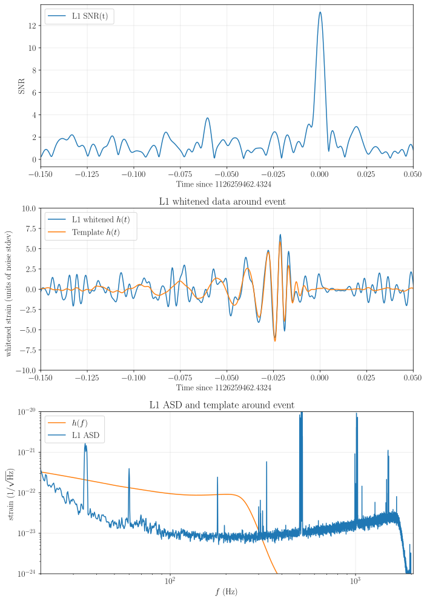

# Power Spectral Density (PSD) in Gravitational-Wave Data Analysis

The detection of gravitational waves relies on distinguishing faint astrophysical signals from background noise in detectors like LIGO and Virgo. The Power Spectral Density (PSD, $S_n(f)$) provides a statistical characterization of this noise as a function of frequency, serving as a important tool for signal detection and parameter estimation.

## Understanding PSD from detection statistics

Given some random process, $n(t)$ as noise recorded by the detector, that is also stationary and has zero mean $\langle n(t) \rangle = 0$, then we can use the general definition of power, time average of the squared signal, and write the power in the noise as:

$$
\begin{align}
P = \lim_{T \to \infty} \frac{1}{T} \int_{-T/2}^{T/2} n^2(t) dt
\end{align}
$$

defining a windowed function of the noise as:

$$
\begin{align}
n_T(t) = \begin{cases}
n(t) & -T/2 \leq t \leq T/2 \\
0 & \text{otherwise}
\end{cases}
\end{align}
$$

Now we have,

$$
\begin{align}
P = \lim_{T \to \infty} \frac{1}{T} \int_{-\infty}^{\infty} n_T^2(t) dt
\end{align}
$$

Using Parseval's theorem, we can express the power in the frequency domain as:

$$
\begin{align}
P &= \lim_{T \to \infty} \frac{1}{T} \int_{-\infty}^{\infty} \vert\tilde{n}_T(f)\vert^2 df \\
&= \lim_{T \to \infty} \frac{2}{T} \int_{0}^{\infty} \vert\tilde{n}_T(f)\vert^2 df
\end{align}
$$

Where I have also used $\tilde{n}_T(-f)=\tilde{n}^*_T(f)$, as $n_T(t)$ is real. continuing, we can write the power as:

$$
\begin{align}
P &= \int_{0}^{\infty} \left( \lim_{T \to \infty} \frac{2}{T} \vert\tilde{n}_T(f)\vert^2 \right) df \\
&= \int_{0}^{\infty} S_n(f) df
\end{align}
$$

where we have defined the **one-sided power spectral density (PSD)** as:

$$
\begin{align}
S_n(f) &= \lim_{T \to \infty} \frac{2}{T} \vert\tilde{n}_T(f)\vert^2 \\
&= \lim_{T \to \infty} \frac{2}{T} \left\vert \int_{-T/2}^{T/2}n_T(t) e^{-2\pi i f t} dt \right\vert^2
\end{align}
$$

Let us express the PSD in terms of the autocorrelation function of the noise, $R_n(\tau) = \langle n(t) n(t+\tau) \rangle$. 

$$
\begin{align}
S_n(f) &= \lim_{T \to \infty} \frac{2}{T} \left\{ \int_{-T/2}^{T/2}n_T(t) e^{-2\pi i f t} dt \right\} \left\{ \int_{-T/2}^{T/2}n_T(t') e^{2\pi i f t'} dt' \right\} \\
\end{align}
$$

change of variables, $t' = t + \tau$ and $dt' = d\tau$, we can write

$$
\begin{align}
S_n(f) &= \int_{-\infty}^{\infty} \left\{ \lim_{T \to \infty} \frac{2}{T} \int_{-T/2}^{T/2} n_T(t) n_T(t + \tau) dt\right\} e^{-2\pi i f \tau} d\tau \\
&= 2 \int_{-\infty}^{\infty} R_n(\tau) e^{-2\pi i f \tau} d\tau
\end{align}
$$

So, PSD is twice the Fourier transform of the autocorrelation function of the noise. Let us relate the PSD to the autocorrelation of the frequency domain noise, $\tilde{n}(f)$.

$$
\begin{align}
\langle \tilde{n}(f) \tilde{n}^*(f') \rangle &= \left\langle \int_{-\infty}^{\infty} n(t) e^{-2\pi i f t} dt \int_{-\infty}^{\infty} n(t') e^{2\pi i f' t'} dt' \right\rangle \\
&= \left\langle \int_{-\infty}^{\infty} n(t) e^{-2\pi i f t} dt \int_{-\infty}^{\infty} n(t+\tau) e^{2\pi i f' (t+\tau)} d\tau \right\rangle \\
&= \int_{-\infty}^{\infty} e^{-2\pi i (f - f') t} dt \int_{-\infty}^{\infty} \langle n(t) n(t+\tau) \rangle  e^{-2\pi i f' \tau}  d\tau \\
&= \delta(f - f') \int_{-\infty}^{\infty} R_n(\tau) e^{-2\pi i f' \tau} d\tau \\
&= \frac{1}{2} \delta(f - f') S_n(f')\\
&= \frac{1}{2} S_n(f) \delta(f - f')
\end{align}
$$

This form of equation is often used in expressing variance of the data-filter (noise only) correlation, in terms of the PSD (see [match filtering](detectionstatistics.md#Match-Filtering-in-the-context-of-Gravitational-Wave-Detection) for details).

## Physical Origin and Significance of Detector Noise

Gravitational-wave detectors are limited by various noise sources, with three main types dominating different frequency ranges: (i) at low frequencies (< 10 Hz), seismic noise from ground motion dominates; (ii) at intermediate frequencies (10-100 Hz), thermal noise in mirror suspensions and optics is most significant; and (iii) at high frequencies (> 100 Hz), quantum (shot) noise from laser light fluctuations prevails. The PSD quantifies the noise power as a function of frequency, thereby establishing the detector's sensitivity floor. The detectability of a gravitational-wave signal is determined by its signal-to-noise ratio (SNR)—a measure calculated by comparing the signal's strength to the noise level described by the PSD (see [Noise-Weighted Inner Product Method](innerproduct.md#noise-weighted-inner-product-method) for details). A detection is claimed only if this SNR surpasses a pre-defined threshold.

## PSD Estimation from Time-Series Data

The raw output from a gravitational-wave detector is a regularly sampled time-series of strain data. To estimate the PSD, a standard procedure based on [Welch’s method](https://en.wikipedia.org/wiki/Welch%27s_method) is used. The data is divided into multiple, often overlapping, segments of equal length. Each segment is multiplied by a window function, typically a [Tukey window](https://en.wikipedia.org/wiki/Window_function#Tukey_window), to reduce [spectral leakage](https://en.wikipedia.org/wiki/Spectral_leakage). A Fourier transform ([FFT](https://en.wikipedia.org/wiki/Fast_Fourier_transform)) is then applied to each windowed segment to convert it to the frequency domain, and the squared magnitude of each transformed segment, known as a periodogram, is calculated. To obtain a robust PSD estimate, these periodograms are combined by taking the median value at each frequency bin, minimizing the impact of transient, non-Gaussian noise glitches. The result is a one-sided PSD, which represents the noise power at positive frequencies (note the the result of FFT is a complex value). It is used in subsequent analyses, such as matched filtering and SNR calculation (see [Noise-Weighted Inner Product Method](innerproduct.md#noise-weighted-inner-product-method) for SNR calculation). For visualization, the Amplitude Spectral Density (ASD), the square root of the PSD, is often plotted, providing an intuitive measure of noise amplitude in units of strain per √Hz.

<figure align="center" style="margin-top: 0px;">
  

  <figcaption align="left" style="margin-top: 20px;"><strong>Figure:</strong> Matched-filtering analysis of GW150914 in LIGO-Livingston (L1) detector, illustrating the role of Power Spectral Density in gravitational-wave detection. The analysis employs a theoretical waveform template (SEOBNRv2) to search through detector data, with noise characteristics quantified by a PSD estimated from nearby data segments. Reproduced from the <a href="https://github.com/gwosc-tutorial/LOSC_Event_tutorial/blob/master/LOSC_Event_tutorial.ipynb">GWOSC tutorial</a>.<br><br>

  <div style="margin-left:2em">
  <strong>(Top) Matched-Filter SNR vs. Time:</strong> This panel shows the matched-filter SNR as a function of time. The SNR peaks sharply when the template aligns with the embedded signal in the data. A detection is claimed when this peak surpasses a predetermined threshold (e.g., SNR > 8).<br><br>

  <strong>(Middle) Whitened Strain and Signal Template:</strong> This panel displays the processed detector strain data (blue) overlaid with the best-fit signal template (orange). To enhance visibility of the faint signal, the data undergoes "whitening"—a process where the Fourier transform is divided by the noise amplitude spectrum (ASD=√PSD). This whitening procedure suppresses excess noise at low frequencies and spectral lines, enabling better visualization of weak signals within the detector's most sensitive frequency band. The data is subsequently band-pass filtered to eliminate residual high-frequency noise. This panel shows close agreement between the whitened template and the signal in the data around the time of maximum SNR.

  <strong>(Bottom) Strain vs. Frequency:</strong> This panel compares the L1 detector’s noise Amplitude Spectral Density (L1 ASD, blue) with the frequency-domain signal template ($h(f)$, orange), both shown in units of strain/$\sqrt{\mathrm{Hz}}$. It illustrates that the signal’s power is concentrated in the detector’s most sensitive frequency band (approximately 30–300 Hz), where the noise ASD is at its minimum. This alignment maximizes the signal-to-noise ratio, which is essential for a confident detection.

  **Note:** Here, the template $h(f)$ is calculated as

  $$
  h(f) = \frac{1}{f_s}\,\mathrm{FFT}(h[n] \times w[n]) \times \sqrt{f}\, ,
  $$

  where $h[n]$ is the time-domain template, $w[n]$ is a Tukey window applied to minimize spectral leakage, and $f_s$ is the sampling frequency. Multiplying by $\sqrt{f}$ ensures that the plotted template has units of strain/$\sqrt{\mathrm{Hz}}$, matching those of the ASD and enabling direct visual comparison across frequencies.
  </div>
</figcaption>
</figure>


## PSD Handling in `gwsnr`

The `gwsnr` package supports multiple methods for specifying the PSD. Users can load pre-computed PSD or ASD files generated by established libraries like Bilby or PyCBC, or provide custom files. Alternatively, when a specific GPS time is supplied, `gwsnr` can automatically download the relevant data segment and estimate the PSD on-the-fly using the robust Welch’s method described above.


## Example Usage

The following example demonstrates how to use `gwsnr` can be initialized with psds in three different ways:

- from `bilby` and `pycbc` package using psds as input (psds name specified in the respective packages)

```python
from gwsnr import GWSNR
# from bilby
# Note: the psd names should end with `psd.txt` or `asd.txt`
gwsnr = GWSNR(
  sampling_frequency = 2048.0,  # sampling frequency of the data. 2048Hz is the default value
  psds = {'L1':'aLIGO_O4_high_asd.txt','H1':'aLIGO_O4_high_asd.txt', 'V1':'AdV_asd.txt'}
)
# or from pycbc
gwsnr = GWSNR(
  sampling_frequency = 2048.0,  # sampling frequency of the data. 2048Hz is the default value
  psds = {'L1':'aLIGOaLIGODesignSensitivityT1800044','H1':'aLIGOaLIGODesignSensitivityT1800044','V1':'AdvVirgo'},
```

You can check the available PSDs in `bilby` from this [link](https://github.com/bilby-dev/bilby/tree/master/bilby/gw/detector/noise_curves) and  for `pycbc` packages using the following commands:

```python
import pycbc.psd
pycbc.psd.get_lalsim_psd_list()
```

- from `bilby` package, using ifos as input (psds are called from `bilby` package):

```python
from gwsnr import GWSNR
# class initialization
gwsnr = GWSNR(
  sampling_frequency = 2048.0,  # sampling frequency of the data. 2048Hz is the default value
  ifos = ['L1'],  # interferometers configurations and psds are called from 'bilby' package
)
```

or you can provide a specific PSD in a interferometer object and provide the object to `GWSNR` initialization:

```python
import bilby
from gwsnr import GWSNR
ifosLIO = bilby.gw.detector.interferometer.Interferometer(
                name = 'LIO',
                power_spectral_density = bilby.gw.detector.PowerSpectralDensity(asd_file='your_asd_file.txt'),
                minimum_frequency = 10.,
                maximum_frequency = 2048.,
                length = 4,
                latitude = 19 + 36. / 60 + 47.9017 / 3600,
                longitude = 77 + 1. / 60 + 51.0997 / 3600,
                elevation = 450.,
                xarm_azimuth = 117.6157,
                yarm_azimuth = 117.6157 + 90.,
                xarm_tilt = 0.,
                yarm_tilt = 0.)
gwsnr = GWSNR(
  sampling_frequency = 2048.0,  # sampling frequency of the data. 2048Hz is the default value
  ifos = [ifosLIO],  # interferometers configurations and psds are called from `bilby` package
)
```

- when you want to create a PSD from a stretch of data for a given time. This will download the data from GWOSC (will take time) and estimate the PSD using Welch's method using 32x4s data segments strating from psd_start_time= analysis_start - psd_duration, where analysis_start is the provided GPS time and psd_duration is 32x4s. Details of the PSD estimation can be found in the [example notebook](https://github.com/GregoryAshton/GWParameterEstimationWorkshop2020/blob/master/notebooks/parameter_estimation_open-data_tutorial.ipynb) of `bilby` workshop 2020.

```python
from gwsnr import GWSNR
# from bilby
gwsnr = GWSNR(
  sampling_frequency = 2048.0,  # sampling frequency of the data. 2048Hz is the default value
  psds = {'L1':1246527224.169434}
)
```
∏
the psd(s) created will be stored in directory 'psd_data' in the current working directory. Next time when you initialize the `GWSNR` class with the same psd(s), it will use the stored psd(s) instead of downloading the data again.

- custom psd/asd with tet file. It should contain two columns: frequency and psd/asd value, separated by space or tab. No header is required. The frequency values should be in Hz and the psd/asd values should be in strain^2/Hz or strain/√Hz units respectively. The frequency values should be in ascending order and the psd/asd values should be positive. The file name should end with `psd.txt` or `asd.txt` to be recognized by gwsnr. Suppose you have a custom PSD file named `custom_psd.txt`:

```python
from gwsnr import GWSNR
gwsnr = GWSNR(
  sampling_frequency = 2048.0,  # sampling frequency of the data. 2048Hz is the default value
  psds = {'L1':'custom_psd.txt'}
)
```


<!-- ## Example Usage

The following example demonstrates how to use gwsnr can be initialized with psds in three different ways:

- from `bilby` and `pycbc` package using psds as input (psds name specified in the respective packages)

```python
from gwsnr import GWSNR
# from bilby
# Note: the psd names should end with `psd.txt` or `asd.txt`
gwsnr = GWSNR(
  sampling_frequency = 2048.0,  # sampling frequency of the data. 2048Hz is the default value
  psds = {'L1':'aLIGO_O4_high_asd.txt','H1':'aLIGO_O4_high_asd.txt', 'V1':'AdV_asd.txt'}
)
# or from pycbc
gwsnr = GWSNR(
  sampling_frequency = 2048.0,  # sampling frequency of the data. 2048Hz is the default value
  psds = {'L1':'aLIGOaLIGODesignSensitivityT1800044','H1':'aLIGOaLIGODesignSensitivityT1800044','V1':'AdvVirgo'},
```

You can check the available PSDs in `bilby` from this [link](https://github.com/bilby-dev/bilby/tree/master/bilby/gw/detector/noise_curves) and  for `pycbc` packages using the following commands:

```python
import pycbc.psd
pycbc.psd.get_lalsim_psd_list()
```

- from `bilby` package, using ifos as input (psds are called from `bilby` package):

```python
from gwsnr import GWSNR
# class initialization
gwsnr = GWSNR(
  sampling_frequency = 2048.0,  # sampling frequency of the data. 2048Hz is the default value
  ifos = ['L1'],  # interferometers configurations and psds are called from 'bilby' package
)
```

or you can provide a specific PSD in a interferometer object and provide the object to `GWSNR` initialization:

```python
import bilby
from gwsnr import GWSNR
ifosLIO = bilby.gw.detector.interferometer.Interferometer(
                name = 'LIO',
                power_spectral_density = bilby.gw.detector.PowerSpectralDensity(asd_file='your_asd_file.txt'),
                minimum_frequency = 10.,
                maximum_frequency = 2048.,
                length = 4,
                latitude = 19 + 36. / 60 + 47.9017 / 3600,
                longitude = 77 + 1. / 60 + 51.0997 / 3600,
                elevation = 450.,
                xarm_azimuth = 117.6157,
                yarm_azimuth = 117.6157 + 90.,
                xarm_tilt = 0.,
                yarm_tilt = 0.)
gwsnr = GWSNR(
  sampling_frequency = 2048.0,  # sampling frequency of the data. 2048Hz is the default value
  ifos = [ifosLIO],  # interferometers configurations and psds are called from `bilby` package
)
```

- when you want to create a PSD from a stretch of data for a given time. This will download the data from GWOSC (will take time) and estimate the PSD using Welch's method using 32x4s data segments strating from psd_start_time= analysis_start - psd_duration, where analysis_start is the provided GPS time and psd_duration is 32x4s. Details of the PSD estimation can be found in the [example notebook](https://github.com/GregoryAshton/GWParameterEstimationWorkshop2020/blob/master/notebooks/parameter_estimation_open-data_tutorial.ipynb) of `bilby` workshop 2020.

```python
from gwsnr import GWSNR
# from bilby
gwsnr = GWSNR(
  sampling_frequency = 2048.0,  # sampling frequency of the data. 2048Hz is the default value
  psds = {'L1':1246527224.169434}
)
```

the psd(s) created will be stored in directory 'psd_data' in the current working directory. Next time when you initialize the `GWSNR` class with the same psd(s), it will use the stored psd(s) instead of downloading the data again.

- custom psd/asd with tet file. It should contain two columns: frequency and psd/asd value, separated by space or tab. No header is required. The frequency values should be in Hz and the psd/asd values should be in strain^2/Hz or strain/√Hz units respectively. The frequency values should be in ascending order and the psd/asd values should be positive. The file name should end with `psd.txt` or `asd.txt` to be recognized by gwsnr. Suppose you have a custom PSD file named `custom_psd.txt`:

```python
from gwsnr import GWSNR
gwsnr = GWSNR(
  sampling_frequency = 2048.0,  # sampling frequency of the data. 2048Hz is the default value
  psds = {'L1':'custom_psd.txt'}
)
``` -->

