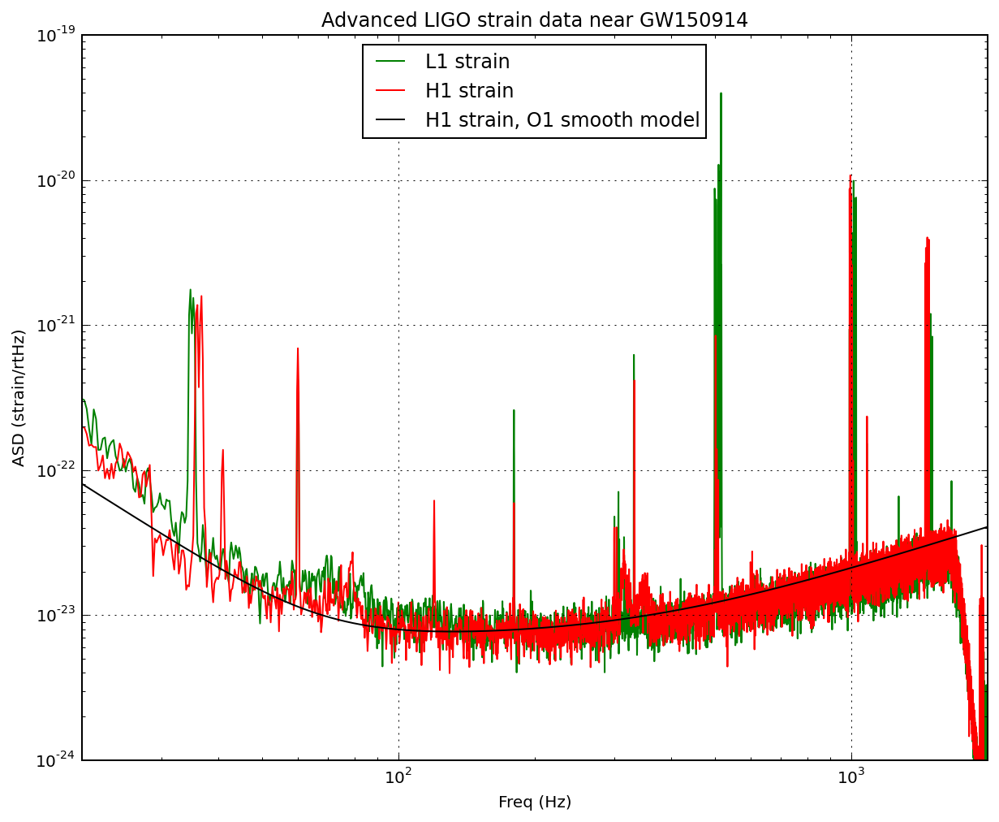

# Power Spectral Density (PSD) in Gravitational-Wave Data Analysis

The detection of gravitational waves relies on distinguishing faint astrophysical signals from background noise in detectors like LIGO and Virgo. The Power Spectral Density (PSD, $S_n(f)$) provides a statistical characterization of this noise as a function of frequency, serving as a important tool for signal detection and parameter estimation.

## Physical Origin and Significance of Detector Noise

Gravitational-wave detectors are limited by various noise sources. At low frequencies (< 10 Hz), seismic noise from ground motion dominates. At intermediate frequencies, thermal noise in mirror suspensions and optics is most significant, while at high frequencies (> 100 Hz), quantum (shot) noise from laser light fluctuations prevails. The PSD quantifies the power of this noise at each frequency bin, establishing the detector’s sensitivity floor. The detectability of a gravitational-wave signal depends on its amplitude exceeding this noise floor, as measured by the signal-to-noise ratio (SNR), which is derived directly from the PSD.

## PSD Estimation from Time-Series Data

The raw output from a gravitational-wave detector is a regularly sampled time-series of strain data. To estimate the PSD, a standard procedure based on [Welch’s method](https://en.wikipedia.org/wiki/Welch%27s_method) is used. The data is divided into multiple, often overlapping, segments of equal length. Each segment is multiplied by a window function, typically a [Tukey window](https://en.wikipedia.org/wiki/Window_function#Tukey_window), to reduce [spectral leakage](https://en.wikipedia.org/wiki/Spectral_leakage). A Fourier transform ([FFT](https://en.wikipedia.org/wiki/Fast_Fourier_transform)) is then applied to each windowed segment to convert it to the frequency domain, and the squared magnitude of each transformed segment, known as a periodogram, is calculated. To obtain a robust PSD estimate, these periodograms are combined by taking the median value at each frequency bin, minimizing the impact of transient, non-Gaussian noise glitches. The result is a one-sided PSD, which represents the noise power at positive frequencies (note the the result of FFT is a complex value). It is used in subsequent analyses, such as matched filtering and SNR calculation. For visualization, the Amplitude Spectral Density (ASD), the square root of the PSD, is often plotted, providing an intuitive measure of noise amplitude in units of strain per √Hz.

<figure  align="center">
  

</figure>


## PSD Estimation from Time-Series Data

The raw output from a gravitational-wave detector is a regularly sampled time-series of strain data. To estimate the PSD, a standard procedure based on Welch’s method is used. The data is divided into multiple, often overlapping, segments of equal length. Each segment is multiplied by a window function, typically a Tukey window, to reduce spectral leakage. A Fourier transform is then applied to each windowed segment to convert it to the frequency domain, and the squared magnitude of each transformed segment, known as a periodogram, is calculated. To obtain a robust PSD estimate, these periodograms are combined by taking the median value at each frequency bin, minimizing the impact of transient, non-Gaussian noise glitches. The resulting one-sided PSD, containing all noise power at positive frequencies, is used in subsequent analyses, such as matched filtering and SNR calculation. For visualization, the Amplitude Spectral Density (ASD), the square root of the PSD, is often plotted, providing an intuitive measure of noise amplitude in units of strain per √Hz.

## PSD Handling in gwsnr

The gwsnr package supports multiple methods for specifying the PSD. Users can load pre-computed PSD or ASD files generated by established libraries like Bilby or PyCBC, or provide custom files. Alternatively, when a specific GPS time is supplied, gwsnr can automatically download the relevant data segment and estimate the PSD on-the-fly using the robust Welch’s method described above.

## Example Usage

The following example demonstrates how to use gwsnr can be initialized with psds in three different ways:

```python